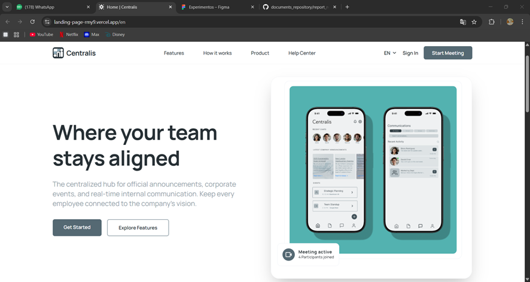
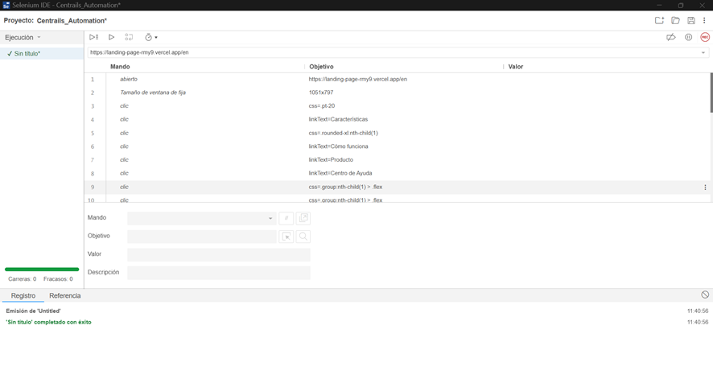

# Capítulo VI: Product Verification & Validation

## 6.1. Testing Suites & Validation

### 6.1.1. Core Entities Unit Tests

En esta sección se detalla la implementación y ejecución de las pruebas unitarias diseñadas para validar la lógica de negocio atómica de las entidades principales de **Centralis**. El objetivo primordial es garantizar que los modelos de dominio, validaciones de atributos y funciones clave operen correctamente en total aislamiento de dependencias externas como bases de datos o servicios de red.

**Landing Page test**

Para la elaboración de los principales tests de nuestra Landing Page (**Centralis**), hemos tenido en cuenta las secciones más importantes que garantizan la correcta navegación y propuesta de valor para el usuario:

* **Features:** Verificación de la visibilidad de las funcionalidades clave para la alineación de equipos.
* **How it works:** Validación del flujo de información sobre el funcionamiento del hub centralizado.
* **Product / Help Center:** Comprobación de los accesos a la documentación y soporte.
* **Sign In / Get Started:** Test de interactividad de los botones de llamada a la acción (Call to Action).

Gracias a la herramienta de **Selenium IDE**, se han logrado realizar los tests funcionales que aseguran que cada elemento de la interfaz responda correctamente a las acciones del usuario.

---

**Web Service test**

A nivel de implementación (`BoundedContextsUnitTests`), las pruebas evalúan la creación de comandos dentro de los contextos acotados de Events, Chats y Announcements. Esto asegura que las abstracciones de dominio (como `CompanyId` o los distintos `UserId`) protejan la integridad de los datos. Se han ejecutado y superado un total de cuatro pruebas unitarias:

- Se procesan exitosamente los comandos de creación de dominio para los contextos de **ANNOUNCEMENT** y **EVENTS**.
- Se validan fallos intencionados al intentar crear un anuncio (`ANNOUNCEMENT`) o un grupo de chat (`CHATS (Groups)`) cuando falta información obligatoria o se incumplen reglas de negocio, corroborando que se lanzan las excepciones correspondientes para mantener la seguridad estructural del sistema.

  

### 6.1.2. Core Integration Tests

En esta sección se detalla la realización de las pruebas de integración implementadas en la arquitectura. El objetivo central de estas evaluaciones es asegurar que los diferentes módulos, servicios y componentes del sistema funcionen correctamente de forma conjunta y cuando interactúan entre sí. A través de estas pruebas conjuntas, se verifica la interoperabilidad, garantizando que la comunicación entre contextos, la persistencia en las bases de datos y los flujos transaccionales mantengan la integridad estructural y la exactitud en el flujo de información de la plataforma.

**Landing Page test**

Se realizó un test automatizado utilizando Selenium IDE para verificar el correcto funcionamiento de la landing page de Centralis. El objetivo del test fue asegurarse de que los elementos clave de la página, como el título principal, la navegación y los botones de acción ("Get Started", "Explore Features"), se cargaran correctamente y fueran interactivos, garantizando una experiencia de usuario óptima.

---

**Web Service**

A nivel de implementación (`MultiTenancyAndFlowIntegrationTests`), estas pruebas simulan un entorno más cercano al escenario de producción utilizando el framework Spring Boot y bases de datos en memoria (H2). Se han verificado exitosamente dos ejes críticos mediante pruebas automatizadas:

- **Aislamiento Multi-tenancy:** Se evalúa y corrobora de forma estricta que un usuario logueado perteneciente a una compañía no puede acceder ni recuperar eventos que pertenecen al dominio de otra distinta.
- **Flujo Operativo Completo:** Se simula el recorrido integral donde un administrador interacciona con los endpoints REST enviando *payloads* validados para crear un Evento corporativo. Esta integración confirma que todos los mecanismos de autorización y recuperación de información están operando sinérgicamente en los contextos principales.

  

### 6.1.3. Core Behavior-Driven Development

*(Sección pendiente de desarrollo según los escenarios Gherkin definidos)*

### 6.1.4. Core System Tests

*(Sección para validación final de extremo a extremo en el entorno de producción)*