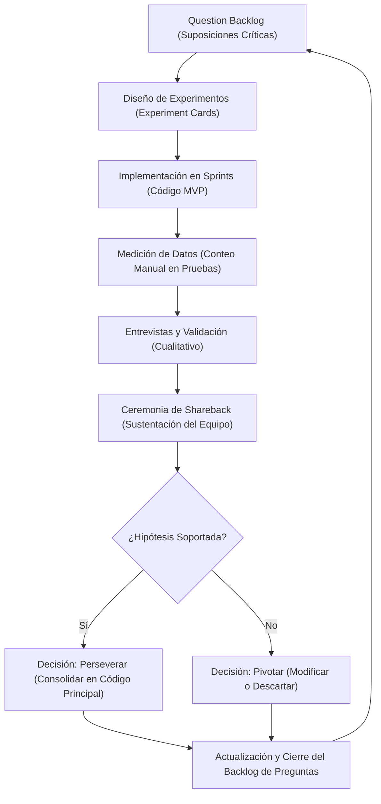

# Capítulo VIII: Experiment-Driven Development

## 8.1. Experiment Planning

### 8.1.1. As-Is Summary

Esta sección consolida la información cualitativa y el material bruto recopilado a partir de las sesiones de validación e interacción con los segmentos objetivos (*Gerentes y Empleados*). El propósito de este bloque no es el diseño inmediato de soluciones técnicas, sino la identificación estructurada de los puntos de partida metodológicos, permitiendo transformar el comportamiento y las observaciones de los usuarios en preguntas de investigación y premisas científicas sujetas a experimentación.

Asimismo, se identifica una problemática operativa adicional en la gestión de eventos corporativos: la falta de centralización en la reserva de espacios físicos internos. Los gerentes actuales coordinan la ubicación de reuniones, capacitaciones y actividades a través de canales informales (mensajes de texto, correos dispersos o verbalmente), lo que genera conflictos de ocupación, duplicación de reservas y pérdida de trazabilidad logística. Esta desarticulación evidencia la necesidad de experimentar con un mecanismo integrado dentro de la creación de eventos que permita asignar formalmente espacios corporativos como laboratorios, oficinas, salas de reuniones, auditorios y áreas comunes.

### 8.1.2. Raw Material: Assumptions, Knowledge Gaps, Ideas, Claims

A partir de las auditorías de experiencia de usuario realizadas, se ha clasificado la materia prima del proyecto en cuatro ejes fundamentales para guiar el diseño de experimentos:

- **Ideas (Propuestas para resolver un problema):**
  - *Automatización de la Sincronización Reactiva (State Management):* Implementar un mecanismo de actualización en tiempo real o reactivo en el árbol de widgets de la aplicación Flutter. Esto evitaría que el usuario deba adivinar o recordar ejecutar un gesto de deslizamiento manual (*pull-to-refresh*) en vistas externas para actualizar la lista de miembros elegibles. El experimento asociado no debe evaluar la animación del indicador, sino validar si la persistencia automática erradica las acciones innecesarias de refresco manual al estructurar eventos corporativos.
  - *Inclusión de Confirmación Binaria de Asistencia:* Añadir un componente interactivo de respuesta (*Aceptar/Rechazar asistencia*) en la vista del empleado para los eventos asignados. El objetivo de evaluar esta premisa es verificar si el flujo de retroalimentación bidireccional mejora la predictibilidad logística de la gerencia en la organización de actividades corporativas.
  - *Reserva de Espacios Físicos Corporativos:* Integrar un módulo de selección y asignación de espacios físicos internos (laboratorios, oficinas, salas de reuniones, auditorios y áreas comunes) dentro del flujo de creación de eventos en la aplicación móvil. El experimento busca validar si la centralización de la reserva de espacios reduce los conflictos de ocupación y elimina la dependencia de canales informales (mensajes de texto o verbal) al conocer de forma precisa la ubicación física de la actividad.
- **Claims (Afirmaciones de los Usuarios):**
  - *"WhatsApp no constituye un canal formal ni seguro para el flujo corporativo":* Los gerentes y empleados afirman de manera categórica que las herramientas de mensajería comercial tradicionales provocan pérdidas críticas de información y carecen de gobernanza de datos.
  - *"El control analítico por perfil es una necesidad operativa legítima y no una transgresión de la privacidad":* Los administradores certifican que auditar el historial de lecturas a nivel laboral es indispensable para garantizar la alineación del equipo, siempre y cuando los datos se limiten estrictamente a cuentas corporativas y no expongan registros personales como el número telefónico privado.
  - *"Dejar la publicación de anuncios globales abierta a todo el personal generará sobrecarga de información y desorden":* Ambos gerentes afirman que un canal sin restricciones jerárquicas saturará la pantalla principal de la aplicación móvil, afectando la visibilidad de los comunicados de alta prioridad.
  - *"La coordinación de espacios físicos para eventos mediante canales informales genera conflictos de ocupación y retrasa la productividad":* Los gerentes afirman que, al no contar con un sistema centralizado de reserva, es frecuente encontrar dos eventos programados en el mismo laboratorio u oficina, o que los empleados lleguen al lugar equivocado porque la comunicación de la ubicación se perdió en el chat informal.
- **Assumptions (Suposiciones del Equipo):**
  - *Suposición de Disponibilidad Inmediata:* El equipo asumió que por el hecho de ser una solución unificada 100% móvil, los usuarios tolerarían tiempos de carga asíncronos prolongados en módulos complejos. Sin embargo, la congelación momentánea de la interfaz (*"quedarse cargando"*) demostró que la tolerancia del usuario móvil a la latencia de procesamiento de las analíticas desde la tarjeta del anuncio es sumamente baja. Dado que el equipo opera bajo planes gratuitos de Render y Supabase y no puede escalar la infraestructura backend, la mejora debe enfocarse en el cliente móvil mediante técnicas de renderizado progresivo (SSE) para mitigar la percepción de bloqueo.
  - *Suposición de la Dirección del Flujo:* Se asumió que el flujo de eventos era unidireccional (la gerencia agenda y notifica, y el empleado simplemente acata). La observación del usuario demostró que la audiencia objetivo asume intrínsecamente que un "evento" requiere un mecanismo de confirmación activa de asistencia para ser considerado funcional.
  - *Suposición de la Irrelevancia de la Ubicación Física:* El equipo asumió inicialmente que la ubicación del evento era un dato secundario que podía comunicarse de forma informal sin impactar la experiencia. Sin embargo, las sesiones de validación revelaron que tanto gerentes como empleados perciben la falta de un campo formal para asignar espacios físicos (laboratorios, oficinas, salas de reuniones, auditorios y áreas comunes) como una brecha crítica que causa incertidumbre logística y retrasa la confirmación de asistencia.
- **Knowledge Gaps (Brechas de Conocimiento):**
  - *Permisología de Publicación Óptima:* El equipo desconoce cuál es el número máximo tolerable de usuarios con permisos de publicación global en una organización de tamaño mediano (50 empleados) antes de que la pantalla principal degrade la experiencia de usuario.
  - *Causa Raíz de la Percepción de Latencia:* Existe una brecha técnica respecto a cuánto mejora la percepción de fluidez y la tasa de retención en la pantalla de analíticas al usar Server-Sent Events (SSE) para renderizado progresivo en Flutter, en comparación con una petición HTTP bloqueante tradicional que espera toda la respuesta antes de renderizar. El equipo no puede optimizar el backend en Render (plan gratuito), por lo que debe validar si el streaming de datos desde el cliente móvil es suficiente para reducir el abandono.
  - *Tasa de Adopción con Confirmación de Asistencia:* Carecemos de datos cuantitativos sobre cuántos empleados interactuarán activamente con un botón de confirmación de asistencia en comparación con el simple acto pasivo de recibir la notificación del evento.
  - *Catálogo y Demanda de Espacios Físicos:* El equipo desconoce el volumen y la tipología de espacios físicos que una PyME gestiona habitualmente, así como la frecuencia de uso de cada tipo (laboratorios, oficinas, salas de reuniones, auditorios y áreas comunes). 


### 8.1.3. Experiment-Ready Questions

Esta sección define el cuestionario científico e instructivo que guiará el diseño de los experimentos de la plataforma **Centralis**. Para asegurar un enfoque riguroso, se utiliza la matriz inicial de *The 5 W’s and 2 H’s* del planteamiento del problema como un marco de contraste frente al comportamiento real de las usuarias en los entornos de producción, mapeando premisas ocultas y convirtiéndolas en variables medibles.

**Preguntas Impulsadas por Creencias (Belief-led Questions)**

Estas preguntas buscan someter a prueba las suposiciones preexistentes del equipo de ingeniería y las afirmaciones categóricas recolectadas en las sesiones de validación respecto al valor del producto:

- **Basada en el "Who" (Stakeholders) y "Why" (Seguridad frente a WhatsApp):**
  - *Pregunta:* ¿Cómo afecta la migración de un canal informal (WhatsApp) a un entorno unificado 100% móvil en la tasa de lectura de los comunicados urgentes por parte de los empleados?
  - *Premisa a probar:* Se cree que al tener los colaboradores el dispositivo móvil permanentemente a la mano, un entorno corporativo dedicado incrementa la tasa de lectura y recepción de comunicados sin vulnerar su privacidad al usar identidades exclusivamente corporativas.
- **Basada en el "What" (Estructura de Anuncios) y el riesgo de Spam:**
  - *Pregunta:* ¿En qué medida la restricción jerárquica de los permisos de publicación de anuncios globales reduce la sobrecarga de información y el desorden visual en la pantalla principal de la aplicación móvil?
  - *Premisa a probar:* Se asume que permitir que el 100% de los empleados publique anuncios globales degrada la priorización de comunicados críticos, siendo necesario limitar esta función a jefes de área o gerencias para mantener la cohesión.
- **Basada en el "How" (Desarticulación de Eventos) y la brecha de Asistencia:**
  - *Pregunta:* ¿De qué manera la inclusión de un mecanismo interactivo de confirmación binaria de asistencia (*Aceptar/Rechazar*) incrementa la predictibilidad logística de la gerencia en comparación con un flujo de notificación puramente pasivo y unidireccional?
  - *Premisa a probar:* Se cree que los coordinadores de las PyMEs requieren una confirmación activa del colaborador en la app móvil para mitigar los errores de ejecución y la duplicación de esfuerzos descritos en el diagnóstico inicial.
- **Basada en el "Where" (Ubicación Física del Evento) y la reserva de espacios:**
  - *Pregunta:* ¿De qué manera la inclusión de un selector de espacios físicos corporativos (laboratorios, oficinas, salas de reuniones, auditorios y áreas comunes) dentro del flujo de creación de eventos reduce los conflictos de ocupación?
  - *Premisa a probar:* Se cree que al centralizar la asignación de espacios físicos en la misma plataforma donde se crea el evento, se eliminarán las duplicaciones de reserva y los empleados tendrán mayor certeza de la ubicación, reduciendo la dependencia de canales informales para coordinar la logística interna.

**Preguntas Exploratorias (Exploratory Questions)**

Estas preguntas están orientadas a explorar y recopilar conocimiento cuantitativo en áreas técnicas y de comportamiento donde el equipo carece de datos previos:

- **Basada en el "When" (Efecto del renderizado en el cliente móvil):**
  - *Pregunta:* ¿En qué medida la implementación de Server-Sent Events (SSE) para el renderizado progresivo de analíticas en la app móvil reduce la tasa de abandono de la pantalla por parte del gerente, en comparación con una petición HTTP bloqueante tradicional?
- **Basada en el "How Much" (Acciones manuales e ineficiencia operativa):**
  - *Pregunta:* ¿En qué medida la sincronización reactiva de estados en la app móvil erradica la necesidad de realizar gestos de actualización manual (*pull-to-refresh*) por parte de los usuarios para reflejar los miembros asignables en una organización?
  - *Pregunta:* ¿Cuál es la tasa de adopción y el número promedio de mensajes diarios que registraría un canal de chat general informal exclusivo para empleados, en contraste con los grupos de chat formales pre-configurados y restringidos por la gerencia?

### 8.1.4. Question Backlog

Esta sección constituye el núcleo de gobernanza del proceso experimental. El Question Backlog organiza y prioriza las preguntas de investigación formuladas anteriormente en función de su nivel de incertidumbre, criticidad de negocio y riesgo técnico, asegurando que el esfuerzo de desarrollo se dirija a mitigar las suposiciones más vulnerables antes de construir código definitivo.

**Sistema de Puntuación y Priorización**

Para establecer un orden objetivo, cada pregunta del backlog se evalúa en una escala del 1 al 5 en cuatro criterios clave:

- **Confianza (Confidence):** Qué tanta certeza tiene el equipo sobre la respuesta (a menor certeza, mayor necesidad de experimentar).
- **Riesgo (Risk):** El peligro potencial para el producto o el negocio si la suposición subyacente resulta ser falsa.
- **Impacto (Impact):** El beneficio operativo o de valor para las PyMEs y la startup si se valida la hipótesis.
- **Interés (Interest):** La relevancia estratégica para los stakeholders y el equipo de ingeniería.

**Matriz del Question Backlog1**

A continuación, se presenta la lista priorizada de preguntas, justificando el **"Por qué"** de su experimentación para fundamentar el esfuerzo invertido:

| **ID** | **Pregunta de Investigación (Experiment-Ready)**             | **El "Por qué" (Motivación y Justificación)**                | **Conf. (1-5)** | **Riesgo (1-5)** | **Imp. (1-5)** | **Int. (1-5)** | **Total** |
| ------ | ------------------------------------------------------------ | ------------------------------------------------------------ | --------------- | ---------------- | -------------- | -------------- | --------- |
| **Q1** | ¿En qué medida la implementación de Server-Sent Events (SSE) para el renderizado progresivo de analíticas en la app móvil reduce la tasa de abandono de la pantalla, en comparación con una petición HTTP bloqueante tradicional? | **Crítico para la retención.** La mejora debe enfocarse en el cliente móvil. Si la interfaz se percibe congelada al esperar una respuesta bloqueante, el gerente abandonará la auditoría, destruyendo el valor del core analítico. | 2               | **5**            | 5              | 5              | **17**    |
| **Q2** | ¿En qué medida la restricción jerárquica de los permisos de publicación reduce la sobrecarga de información y el desorden visual en la pantalla móvil? | **Evitar degradación de la UX.** Si el feed global se satura de spam por falta de roles, los comunicados urgentes perderán visibilidad por completo. | 3               | **4**            | 5              | 4              | **16**    |
| **Q3** | ¿De qué manera la inclusión de un mecanismo de confirmación binaria de asistencia (*Aceptar/Rechazar*) incrementa la predictibilidad logística de la gerencia? | **Cierre de brecha de valor.** El usuario asume que un evento requiere respuesta activa; sin esto, el flujo es unidireccional e ineficiente. | 2               | **4**            | 4              | 4              | **14**    |
| **Q4** | ¿En qué medida la sincronización reactiva de estados en la app móvil erradica la necesidad de realizar gestos de actualización manual (*pull-to-refresh*) por parte de los usuarios? | **Optimización de flujos.** Mitiga la fricción heurística detectada donde el usuario debe forzar la actualización de miembros de forma manual en vistas externas para poder asignarlos. | 3               | **3**            | 4              | 4              | **14**    |
| **Q5** | ¿Cómo afecta la migración de WhatsApp a un entorno unificado móvil en la tasa de lectura de los comunicados urgentes? | **Validar el Core Business.** Justifica la existencia de Centralis frente a los canales informales del mercado de PyMEs. | 4               | **2**            | 5              | 4              | **15**    |
| **Q6** | ¿De qué manera la inclusión de un selector de espacios físicos corporativos (laboratorios, oficinas, salas de reuniones, auditorios y áreas comunes) dentro del flujo de creación de eventos reduce los conflictos de ocupación? | **Cierre de brecha logística.** Los gerentes y empleados reportan que la coordinación informal de espacios genera duplicaciones de reserva y retrasos. Sin un sistema centralizado, el valor del módulo de eventos permanece incompleto. | 3               | **4**            | 4              | 4              | **15**    |

### 8.1.5. Experiment Cards

En esta sección se formalizan los instrumentos de diseño experimental para las hipótesis de mayor criticidad y riesgo técnico identificadas en el *Question Backlog*. Cada tarjeta opera como un contrato científico que delimita el entorno de prueba, los indicadores clave de rendimiento (KPI) y los umbrales cuantitativos que determinarán si una suposición se consolida como característica definitiva en la arquitectura de producción de **Centralis** o si debe ser descartada.

Tarjeta de Experimento 1 (EX-01): Renderizado Progresivo de Analíticas con Server-Sent Events

| **Componente EDD**     | **Detalle y Especificación Técnica del Experimento**         |
| ---------------------- | ------------------------------------------------------------ |
| **Origen del Backlog** | **Q1:** ¿En qué medida la implementación de Server-Sent Events (SSE) para el renderizado progresivo de analíticas en la app móvil reduce la tasa de abandono de la pantalla, en comparación con una petición HTTP bloqueante tradicional? |
| **Hipótesis (Belief)** | **Creemos que** implementar Server-Sent Events (SSE) en la app móvil Flutter para recibir datos analíticos progresivamente desde el backend en Render, combinado con un indicador de carga (Spinner) y renderizado incremental, **para** los administradores que auditan lecturas corporativas, **dará como resultado** una reducción significativa en la percepción de congelamiento de la pantalla y una disminución de la tasa de abandono, a pesar de no poder optimizar el backend en su plan gratuito. |
| **Prueba (Test)**      | Realizar una prueba de usabilidad con **3 gerentes**. Se les solicitará abrir las analíticas de lectura de un anuncio corporativo reciente y completar la auditoría. Cada gerente probará ambas versiones en sesiones separadas (secuencia balanceada: control con HTTP bloqueante y experimental con conexión SSE, Spinner y renderizado progresivo). |
| **Métrica (Metric)**   | 1. **DBM-01** (Screen Abandonment Rate): Porcentaje de gerentes que abandonan la pantalla de analíticas antes de completar la auditoría.<br /> 2. **DBM-02** (Task Success Rate): Porcentaje de gerentes que completan exitosamente la revisión de analíticas. |
| **Criterio de Éxito**  | **Estaremos en lo correcto si:** Ningún gerente abandona la pantalla al usar la versión experimental (SSE), y al menos **2 de 3** completan la auditoría con éxito. |

Tarjeta de Experimento 2 (EX-02): Confirmación Binaria de Asistencia a Eventos

| **Componente EDD**     | **Detalle y Especificación Técnica del Experimento**         |
| ---------------------- | ------------------------------------------------------------ |
| **Origen del Backlog** | **Q3:** ¿De qué manera la inclusión de un mecanismo de confirmación de asistencia incrementa la predictibilidad logística? |
| **Hipótesis (Belief)** | **Creemos que** integrar botones interactivos de confirmación activa (*Aceptar / Rechazar asistencia*) en las tarjetas de eventos dentro del feed del empleado, **para** los colaboradores de las PyMEs, **dará como resultado** un ecosistema de retroalimentación bidireccional que otorgará un respaldo logístico inmediato a la gerencia, eliminando la desarticulación operativa de calendarios externos desincronizados. |
| **Prueba (Test)**      | Realizar una prueba de usabilidad con **3 empleados**. Se les asignará la tarea de revisar el cronograma semanal y confirmar su asistencia a una capacitación corporativa simulada. Cada empleado probará ambas versiones en sesiones separadas (secuencia balanceada). |
| **Métrica (Metric)**   | **DBM-04** (Active Interaction Rate): Porcentaje de empleados que interactúan con los botones de confirmación (Aceptar/Rechazar) entre el total de usuarios notificados. |
| **Criterio de Éxito**  | **Estaremos en lo correcto si:** Al menos **2 de 3** empleados (66.7%) interactúan proactivamente con el componente binario, y ninguno reporta confusión sobre el significado de las opciones. |

Tarjeta de Experimento 3 (EX-03): Sincronización Reactiva de Estados (State Management)

| **Componente EDD**     | **Detalle y Especificación Técnica del Experimento**         |
| ---------------------- | ------------------------------------------------------------ |
| **Origen del Backlog** | **Q4:** ¿En qué medida la sincronización reactiva de estados en la app móvil erradica la necesidad de realizar gestos de actualización manual (*pull-to-refresh*) por parte de los usuarios? |
| **Hipótesis (Belief)** | **Creemos que** reestructurar el flujo con un gestor de estado reactivo en Flutter, **para** los gerentes que asignan empleados a un evento o chat grupal, **dará como resultado** la erradicación del gesto manual invasivo de retroceder al perfil y deslizar hacia abajo para refrescar los miembros del equipo. |
| **Prueba (Test)**      | Realizar una prueba de usabilidad con **3 gerentes**. Se les solicitará crear un evento grupal y asignar 3 empleados. Cada gerente probará ambas versiones en sesiones separadas (secuencia balanceada). El **Grupo A** usa el flujo actual con recarga manual; el **Grupo B** usa el flujo con reactividad automatizada. |
| **Métrica (Metric)**   | **DBM-08** (Unnecessary Actions Count): Conteo de gestos manuales de refresco (*pull-to-refresh*) o clics de recarga innecesarios fuera del flujo óptimo durante la ejecución de la tarea. |
| **Criterio de Éxito**  | **Estaremos en lo correcto si:** Los **3 gerentes** no requieren ejecutar gestos de refresco manual en la versión reactiva (el promedio de acciones innecesarias es igual a cero en la versión reactiva). |

Tarjeta de Experimento 4 (EX-04): Reserva de Espacios Físicos Corporativos en Eventos

| **Componente EDD**     | **Detalle y Especificación Técnica del Experimento**         |
| ---------------------- | ------------------------------------------------------------ |
| **Origen del Backlog** | **Q6:** ¿De qué manera la inclusión de un selector de espacios físicos corporativos reduce los conflictos de ocupación? |
| **Hipótesis (Belief)** | **Creemos que** integrar un selector de espacios físicos internos (laboratorios, oficinas, salas de reuniones, auditorios y áreas comunes) dentro del flujo de creación de eventos en la app móvil, **para** los gerentes de PyMEs que organizan actividades corporativas, **dará como resultado** una eliminación de los conflictos de doble reserva, al proporcionar una ubicación precisa y trazable desde el mismo canal oficial. |
| **Prueba (Test)**      | Realizar una prueba de usabilidad con **3 gerentes y 3 empleados** (6 participantes). Se les solicitará programar y confirmar asistencia a **dos eventos simulados** (una reunión de área y una actividad grupal). El **Grupo A (Control)** crea eventos sin campo de espacio físico. El **Grupo B (Experimental)** utiliza el flujo con el selector de espacios habilitado. |
| **Métrica (Metric)**   | **DBM-06** (Occupancy Conflict Rate): Porcentaje de eventos con doble reserva o sin espacio asignado. |
| **Criterio de Éxito**  | **Estaremos en lo correcto si:** El Grupo B no reporta conflictos de doble reserva (0%). |

## 8.2. Experiment Design

### 8.2.1. Hypotheses

Esta sección presenta las declaraciones de creencia para cada experimento identificado en el *Question Backlog*. Cada hipótesis de trabajo (H₁) es formulada para ser testable y medible, y se empareja con una hipótesis nula (H₀) que postula que no existirá diferencia significativa como resultado del cambio. Estas hipótesis serán sometidas a prueba, no validadas como "verdaderas", alineándose con el enfoque científico del *Experiment-Driven Development*.

**Experimento 1 (EX-01): Renderizado Progresivo de Analíticas con Server-Sent Events**
- **H₁ (Hipótesis de Trabajo):** *Implementar Server-Sent Events (SSE) en la app móvil Flutter para recibir datos analíticos progresivamente desde el backend en Render, combinado con un indicador de carga (Spinner) y renderizado incremental, disminuirá significativamente la tasa de abandono de la pantalla de analíticas al evitar que la interfaz se perciba congelada.*
- **H₀ (Hipótesis Nula):** *No existirá diferencia significativa en la tasa de abandono de la pantalla de analíticas entre la versión con petición HTTP bloqueante (control) y la versión con SSE progresivo (experimental). Cualquier diferencia observada se atribuye al azar.*

**Experimento 2 (EX-02): Confirmación de Asistencia a Eventos**
- **H₁ (Hipótesis de Trabajo):** *Integrar botones interactivos de confirmación activa (*Aceptar / Rechazar*) en las tarjetas de eventos incrementará significativamente la tasa de interacción activa de los empleados y la predictibilidad logística para la gerencia.*
- **H₀ (Hipótesis Nula):** *No existirá diferencia significativa en la tasa de interacción activa ni en la predictibilidad logística entre el flujo actual sin confirmación y el flujo con confirmación binaria. Cualquier diferencia observada se atribuye al azar.*

**Experimento 3 (EX-03): Sincronización Reactiva de Estados (State Management)**
- **H₁ (Hipótesis de Trabajo):** *Reestructurar el flujo con un gestor de estado reactivo en Flutter erradicará completamente la necesidad de realizar gestos de actualización manual (*pull-to-refresh*) para sincronizar los miembros de la organización.*
- **H₀ (Hipótesis Nula):** *No existirá diferencia significativa en la cantidad de acciones innecesarias de refresco manual ejecutadas entre el flujo con recarga manual (control) y el flujo con reactividad automatizada (experimental). Cualquier diferencia observada se atribuye al azar.*

**Experimento 4 (EX-04): Reserva de Espacios Físicos Corporativos en Eventos**
- **H₁ (Hipótesis de Trabajo):** *Integrar un selector de espacios físicos internos dentro del flujo de creación de eventos eliminará los conflictos de doble reserva.*
- **H₀ (Hipótesis Nula):** *No existirá diferencia significativa en la tasa de conflictos de ocupación entre el flujo sin selector de espacios (control) y el flujo con selector (experimental). Cualquier diferencia observada se atribuye al azar.*

### 8.2.2. Domain Business Metrics

Esta sección define el catálogo centralizado de métricas de negocio para el dominio de **Centralis**. Su propósito es alinear la medición de todos los experimentos con objetivos de negocio concretos, evitando el uso de *vanity metrics* o métricas ad-hoc no predefinidas. Todas las *Experiment Cards* y secciones posteriores únicamente harán referencia a las métricas aquí establecidas. Cada métrica incluye su fórmula de cálculo, técnica de recolección y meta deseada.

| **ID** | **Métrica de Negocio** | **Fórmula de Cálculo** | **Técnica de Recolección** | **Meta Deseada** |
| ------ | ---------------------- | ---------------------- | -------------------------- | ---------------- |
| **DBM-01** | **Screen Abandonment Rate** | (Número de usuarios que abandonan la pantalla antes de completar la tarea / Número total de usuarios que inician la tarea) × 100. | Observación directa en sesiones de prueba de usabilidad y registro en hoja de cálculo. | < 10% |
| **DBM-02** | **Task Success Rate** | (Número de usuarios que completan exitosamente la tarea / Número total de usuarios que inician la tarea) × 100. | Observación directa en sesiones de prueba y registro manual. | > 90% |
| **DBM-04** | **Active Interaction Rate** | (Número de usuarios que interactúan activamente con el componente objetivo / Número total de usuarios expuestos al componente) × 100. | Registro manual del total de interacciones (clics en Aceptar/Rechazar) observadas directamente durante las sesiones de usabilidad. | > 85% |
| **DBM-06** | **Occupancy Conflict Rate** | (Número de eventos con doble reserva o sin espacio asignado / Número total de eventos creados en el período) × 100. | Registro y conteo manual de colisiones de espacio observadas directamente en el flujo de las pruebas. | 0% |
| **DBM-07** | **Read Confirmation Rate** | (Número de anuncios confirmados como leídos por el destinatario / Número total de anuncios enviados) × 100. | Registro manual de confirmaciones de lectura durante el período de evaluación. | > 90% en 24 horas |
| **DBM-08** | **Unnecessary Actions Count** | Conteo de gestos o interacciones fuera del flujo óptimo (ej. *pull-to-refresh* manual, retroceso innecesario) durante la ejecución de una tarea. | Observación directa en sesiones de prueba de usabilidad y conteo manual. | 0 acciones innecesarias |

### 8.2.3. Measures

Esta sección detalla los criterios seleccionados para recopilar la evidencia que permitirá responder las preguntas de investigación y detectar evidencia secundaria.

**Medidas para EX-01: Renderizado Progresivo de Analíticas con Server-Sent Events**
- **Medida 1 (M1-01):** Tasa de abandono de la pantalla de analíticas (DBM-01). Se observará directamente durante las sesiones de prueba con 3 gerentes, anotando cuántos abandonan antes de completar la auditoría en cada versión.
- **Medida 2 (M1-02):** Tasa de éxito de la tarea de auditoría (DBM-02). Se registrará de forma observacional directa durante las sesiones de prueba, verificando si el gerente logra visualizar y comprender las analíticas de lectura.

- **Medida 1 (M2-01):** Tasa de interacción activa con el componente de confirmación (DBM-04). Se recolectará mediante observación directa y registro manual del evaluador durante la sesión de pruebas con los 3 empleados.
- **Medida 2 (M2-02):** Registro observacional manual de las respuestas de confirmación completadas por cada participante anotadas por el evaluador.

**Medidas para EX-03: Sincronización Reactiva de Estados**
- **Medida 1 (M3-01):** Tasa de finalización exitosa de la tarea de asignación (DBM-02), registrada observacionalmente al verificar si el gerente logra guardar el evento con los miembros deseados.
- **Medida 2 (M3-02):** Número de acciones innecesarias (DBM-08). Se registrará mediante observación directa en las sesiones de prueba, contando las instancias en las que el usuario ejecuta un gesto de *pull-to-refresh* manual.

**Medidas para EX-04: Reserva de Espacios Físicos Corporativos**
- **Medida 1 (M4-01):** Tasa de conflictos de ocupación (DBM-06). Se observará directamente en las pruebas piloto con los participantes, verificando si ocurren conflictos de doble reserva.

### 8.2.4. Conditions

Esta sección describe los factores que permiten identificar el motivo subyacente detrás de una respuesta. Para cada experimento se definen una **condición experimental** (bajo la cual se busca obtener evidencia a favor de la hipótesis alternativa H₁) y una **condición de control** (que actúa bajo la suposición de que la hipótesis nula H₀ es correcta). Las condiciones se aplican exclusivamente sobre la app móvil de **Centralis**, dado que el backend (Web Service) actúa como infraestructura de soporte indistinta para ambos grupos.

**Condiciones para EX-01: Renderizado Progresivo de Analíticas con Server-Sent Events**
- **Condición de Control (C-01):** La app móvil mantiene el flujo actual de petición HTTP bloqueante tradicional. Al abrir la pantalla de analíticas, la app envía una única petición al backend en Render y espera la respuesta completa antes de renderizar cualquier dato. No hay indicadores visuales intermedios ni feedback progresivo. El gerente percibe la latencia como una congelación de la interfaz.
- **Condición Experimental (E-01):** La app móvil abre una conexión SSE (Server-Sent Events) al endpoint de analíticas en el backend de Render. Recibe los datos analíticos en chunks progresivos y los renderiza incrementalmente en la interfaz. Durante los primeros 500 ms de espera se muestra un indicador de carga (Spinner). El backend permanece en su configuración actual sin optimización, dado que el equipo opera bajo plan gratuito.

**Condiciones para EX-02: Confirmación Binaria de Asistencia a Eventos**
- **Condición de Control (C-02):** El empleado recibe la notificación del evento en su feed, pero la tarjeta de evento no contiene botones de confirmación. El flujo es puramente pasivo y unidireccional: la gerencia publica y el empleado solo visualiza.
- **Condición Experimental (E-02):** La tarjeta de evento en el feed del empleado incluye botones interactivos de confirmación activa (*Aceptar / Rechazar asistencia*). La respuesta se registra en tiempo real en la base de datos de Supabase.

**Condiciones para EX-03: Sincronización Reactiva de Estados**
- **Condición de Control (C-03):** El flujo de creación de eventos mantiene la arquitectura actual. El gerente debe retroceder al perfil y ejecutar un gesto de *pull-to-refresh* para actualizar la lista de miembros elegibles en una vista externa. No existe sincronización automática entre la base de datos y la interfaz de selección.
- **Condición Experimental (E-03):** El flujo se reestructura con un gestor de estado reactivo en Flutter que sincroniza automáticamente los hilos con la base de datos de Supabase. La lista de miembros se actualiza en tiempo real sin requerir gestos manuales de refresco.

**Condiciones para EX-04: Reserva de Espacios Físicos Corporativos**
- **Condición de Control (C-04):** El flujo de creación de eventos no incluye campo de ubicación física. El gerente comunica la ubicación del evento mediante canales externos (mensaje de texto o verbalmente). No existe trazabilidad ni control de disponibilidad de espacios.
- **Condición Experimental (E-04):** El flujo de creación de eventos incluye un selector de espacios físicos internos (laboratorios, oficinas, salas de reuniones, auditorios y áreas comunes) con visualización de disponibilidad y capacidad en tiempo real. El espacio seleccionado se bloquea automáticamente en la base de datos para evitar doble reserva.

### 8.2.5. Scale Calculations and Decisions

Esta sección determina la cantidad de evidencia necesaria para cada experimento, basándose en la **Certeza** (probabilidad de error aceptable) y la **Precisión** (granularidad del cambio a detectar). Se establece el nivel de significancia (α), el poder estadístico (1-β) y el Efecto Mínimo Detectable (MDE) para cada experimento. A partir de estos parámetros, se calcula el tamaño de muestra mínimo requerido para cada grupo (control y experimental).

**Parámetros Generales**
- **Nivel de Significación (α):** 0.05 (5%). Esto implica que se acepta un 5% de probabilidad de cometer un error Tipo I (rechazar H₀ cuando es verdadera).
- **Poder Estadístico (1-β):** 0.80 (80%). Esto establece que se desea un 80% de probabilidad de detectar un efecto real cuando existe, minimizando el riesgo de error Tipo II.
- **Nivel de Confianza:** 95% (1 - α).

**Cálculos por Experimento**

**EX-01: Renderizado Progresivo de Analíticas con Server-Sent Events**
- **MDE:** Se busca detectar una reducción cualitativa en la tasa de abandono de la pantalla de analíticas. En una prueba de usabilidad con muestra pequeña, el objetivo es que **ningún participante** al probar la versión experimental abandone la pantalla, en comparación con la versión de control donde se espera que al menos 1 de 3 abandone.
- **Cálculo de Tamaño de Muestra:** Para una prueba de usabilidad con diseño within-subjects (cada participante evalúa ambas variantes), un tamaño de **n = 3 gerentes** permite detectar problemas críticos de usabilidad según las heurísticas de Nielsen.
- **Decisión:** Dado que la intervención se realiza únicamente en el cliente móvil (SSE + Spinner) y el objetivo es obtener evidencia rápida para iterar, un tamaño de 3 gerentes en total es suficiente para una prueba de usabilidad estructurada within-subjects.

**EX-02: Confirmación Binaria de Asistencia a Eventos**
- **MDE:** Se busca detectar un incremento en la tasa de interacción activa. En una prueba de usabilidad con diseño within-subjects (misma persona prueba ambas versiones), se espera que al menos 2 de 3 empleados interactúen con el botón de confirmación.
- **Cálculo de Tamaño de Muestra:** Para una prueba de usabilidad within-subjects con un componente UI binario, un tamaño de **n = 3 empleados** permite capturar la variabilidad de comportamiento y detectar problemas de comprensión del componente.
- **Decisión:** Un tamaño de 3 empleados es viable para una prueba de usabilidad rápida y permite obtener feedback cualitativo sobre la claridad del componente binario.

**EX-03: Sincronización Reactiva de Estados**
- **MDE:** Se busca detectar la erradicación de las acciones innecesarias de refresco manual. En una prueba de usabilidad within-subjects, se espera que los gerentes no requieran realizar gestos de refresco manual.
- **Cálculo de Tamaño de Muestra:** Un tamaño de **n = 3 gerentes** permite obtener una observación clara de si los usuarios ejecutan gestos manuales innecesarios al asignar miembros.
- **Decisión:** Un tamaño de 3 gerentes es suficiente para una prueba de usabilidad estructurada orientada al conteo de acciones manuales innecesarias.

**EX-04: Reserva de Espacios Físicos Corporativos**
- **MDE:** Se busca detectar una eliminación de conflictos de ocupación. En una prueba de usabilidad con 3 gerentes y 3 empleados, se espera 0 conflictos de reserva.
- **Cálculo de Tamaño de Muestra:** Para una prueba piloto de un nuevo flujo de creación de eventos, un tamaño de **3 gerentes + 3 empleados (6 en total)** permite evaluar tanto la experiencia de creación como la de asistencia en un contexto realista.
- **Decisión:** Un tamaño de 6 participantes en total (todos los reclutados en la muestra) es adecuado para una prueba piloto de un flujo completo, capturando la interacción entre ambos segmentos objetivo en un escenario controlado.

**Resumen de Escalabilidad**

| **Experimento** | **Método** | **Tamaño por Grupo (n)** | **Total de Usuarios** | **Duración** |
| --------------- | ---------- | ------------------------ | --------------------- | ------------ |
| **EX-01** | Prueba de usabilidad within-subjects | 3 gerentes | 3 | 1 sesión por participante |
| **EX-02** | Prueba de usabilidad within-subjects | 3 empleados | 3 | 1 sesión por participante |
| **EX-03** | Prueba de usabilidad within-subjects | 3 gerentes | 3 | 1 sesión por participante |
| **EX-04** | Prueba piloto estructurada | 3 gerentes + 3 empleados | 6 | 2 eventos simulados |

### 8.2.6. Methods Selection

Esta sección describe la técnica de investigación seleccionada para cada experimento, aplicando el principio del **Simplest Useful Thing** (la cosa más simple y útil) para alcanzar el tamaño de muestra y las condiciones necesarias. Se distingue claramente entre el objeto de investigación (la pregunta o hipótesis) y el método (la técnica aplicada). Se considera la norma ética de no ejecutar simultáneamente dos o más experimentos sobre el mismo tema que puedan exponer a un solo usuario a ambos.

**Método para EX-01: Renderizado Progresivo de Analíticas con Server-Sent Events**
- **Método seleccionado:** Prueba de usabilidad con observación directa (Usability Testing) en entorno controlado, diseño within-subjects.
- **Justificación:** Es el método más simple para comparar la percepción de fluidez entre dos variantes de renderizado de analíticas con un número reducido de participantes. Con 3 gerentes en total se pueden detectar problemas críticos de usabilidad y obtener evidencia cualitativa sobre la percepción de congelamiento al experimentar ambas versiones. No requiere despliegue a producción ni seguimiento prolongado.
- **Consideración ética:** Los gerentes participantes no serán expuestos simultáneamente a ningún otro experimento relacionado con el módulo de anuncios o analíticas durante la sesión de prueba.

**Método para EX-02: Confirmación Binaria de Asistencia a Eventos**
- **Método seleccionado:** Prueba de usabilidad con observación directa (Usability Testing) en entorno controlado, diseño within-subjects.
- **Justificación:** Dado que se busca validar la interacción proactiva de los empleados con un nuevo componente UI, la observación directa con 3 empleados es el método más simple para capturar la tasa de interacción y detectar confusiones en la interfaz. El diseño within-subjects (mismo empleado prueba ambas versiones) reduce la varianza entre participantes y permite obtener feedback comparativo directo.
- **Consideración ética:** Los empleados participantes no serán asignados simultáneamente al experimento EX-03 (sincronización reactiva) para evitar sesgos en el flujo de eventos.

**Método para EX-03: Sincronización Reactiva de Estados**
- **Método seleccionado:** Prueba de usabilidad con observación directa y conteo de acciones innecesarias.
- **Justificación:** Es el método más simple para registrar si los usuarios intentan forzar la actualización de la lista de miembros asignables. La observación directa permite contar de forma manual los gestos de refresco manual ejecutados por los gerentes durante el flujo de trabajo en la app.
- **Consideración ética:** Los gerentes participantes no serán expuestos simultáneamente al experimento EX-04 (reserva de espacios) para evitar sobrecarga cognitiva en el flujo de creación de eventos.

**Método para EX-04: Reserva de Espacios Físicos Corporativos**
- **Método seleccionado:** Prueba piloto estructurada (Pilot Test) con observación directa en entorno simulado.
- **Justificación:** Es el método más simple para evaluar la eficacia de un nuevo flujo de selección de espacios con un número reducido de participantes. Con 3 gerentes y 3 empleados se puede observar la interacción completa entre creador y asistente en un escenario realista, capturando la tasa de conflictos sin requerir despliegue a escala.
- **Consideración ética:** Los gerentes del grupo experimental no utilizarán simultáneamente el módulo de confirmación binaria (EX-02) para evitar que la interacción con la confirmación de asistencia distraiga de la evaluación del selector de espacios.

### 8.2.7. Data Analytics: Goals, KPIs and Metrics Selection

Esta sección establece la preparación analítica para garantizar la economía en el rastreo de datos, asegurando que las métricas y KPIs seleccionados permitan detectar diferencias precisas y cambios significativos en el comportamiento del usuario. Todos los objetivos se alinean con las métricas de dominio (DBM) definidas en la sección 8.2.2.

**Metas Analíticas (Goals)**
- **G1: Validar la reducción de fricción técnica en el cliente móvil.** Confirmar que la implementación de SSE para renderizado progresivo de analíticas en la app móvil reduce la tasa de abandono de la pantalla.
- **G2: Validar el incremento de participación activa.** Confirmar que la confirmación binaria de asistencia transforma el flujo de eventos de unidireccional a bidireccional mediante interacciones guardadas en la base de datos.
- **G3: Validar la eficiencia en flujos de creación.** Confirmar que la sincronización reactiva erradica las acciones innecesarias de refresco manual en la gestión de eventos.
- **G4: Validar la integridad logística de eventos.** Confirmar que la reserva de espacios físicos elimina conflictos de ocupación.

**KPIs (Indicadores Clave de Rendimiento)**
- **KPI-1 (Retención de Auditoría):** Tasa de usuarios que completan la auditoría de lecturas sin abandonar. *Métrica asociada: DBM-01 (Screen Abandonment Rate).*
- **KPI-2 (Participación en Eventos):** Porcentaje de empleados que confirman/rechazan asistencia durante las pruebas de usabilidad. *Métrica asociada: DBM-04 (Active Interaction Rate).*
- **KPI-3 (Eficiencia de Flujo):** Tasa de usuarios que finalizan la asignación sin ejecutar refrescos manuales (*pull-to-refresh*). *Métrica asociada: DBM-08 (Unnecessary Actions Count).*
- **KPI-4 (Precisión Logística):** Porcentaje de eventos ejecutados sin conflictos de espacio. *Métrica asociada: DBM-06 (Occupancy Conflict Rate).*

**Métricas de Seguimiento (Tracking Metrics)**
- **Métricas de Rendimiento Técnico:** No se definen métricas automáticas de backend. El rendimiento de carga progresiva se evalúa de manera cualitativa en el cliente móvil mediante la percepción de fluidez declarada verbalmente por los usuarios en las pruebas de usabilidad.

- **Métricas de Comportamiento de Usuario:** DBM-02 (Task Success Rate) y DBM-08 (Unnecessary Actions Count) para detectar patrones de uso y fricción heurística.

  

### 8.2.8. Web and Mobile Tracking Plan

Dado que la solución de **Centralis** se compone exclusivamente de una **aplicación móvil nativa** (desarrollada en Flutter) y un **Web Service** (backend RESTful desplegado en Render con base de datos en Supabase), el plan de rastreo se centra en la recolección de datos desde estos dos componentes. No se incluye seguimiento de Landing Page ni de Frontend Web Applications, ya que estos productos no forman parte del alcance experimental ni del modelo de negocio digital actual de la plataforma.

**Arquitectura de Rastreo**
- **App Móvil (Flutter):** Recolección de datos observacional mediante registro manual por parte del evaluador en una hoja de cálculo para el análisis de comportamiento de usuarios (abandonos, éxito de tareas e interacciones no deseadas como gestos manuales de refresco).
- **Backend (Web Service en Render) y Base de Datos (Supabase):** Consultas directas a las tablas transaccionales de Supabase (`asistencias`, `reservas_espacios`, `confirmaciones_lectura`) para verificar la persistencia y la tasa de interacción activa real de los participantes.

**Criterios de Registro por Experimento**

**EX-01: Renderizado Progresivo de Analíticas con Server-Sent Events**
- **Registro Observacional (Hoja de cálculo):**
  - Si el gerente abandona la pantalla antes de completarse la carga de analíticas (Sí/No).
  - Si el gerente completa la tarea de auditoría con éxito (Sí/No).
  - Comentarios del gerente respecto a la percepción de fluidez (cualitativo).

**EX-02: Confirmación Binaria de Asistencia a Eventos**
- **Registro en Base de Datos:**
  - Inserción/actualización de registros en la tabla de asistencias (`confirmado` o `rechazado`).
- **Registro Observacional (Hoja de cálculo):**
  - Si el empleado interactúa con el botón binario de confirmación (Sí/No).

**EX-03: Sincronización Reactiva de Estados**
- **Registro Observacional (Hoja de cálculo):**
  - Conteo de gestos manuales de refresco (*pull-to-refresh*) ejecutados por el gerente durante el flujo.
  - Si el gerente completa la asignación de miembros con éxito (Sí/No).

**EX-04: Reserva de Espacios Físicos Corporativos**
- **Registro en Base de Datos:**
  - Registro de reservas de espacio en la tabla de eventos para verificar si existen colisiones (Occupancy Conflict Rate).

**Dashboard de Seguimiento**
- Se utilizará una hoja de cálculo simple Google Sheets para consolidar manualmente los resultados observados por el evaluador en cada sesión de prueba (abandonos, acciones incorrectas y respuestas cualitativas).
- Se utilizará la consola de Supabase para realizar consultas SQL básicas directas a las tablas y verificar el correcto guardado de los registros en tiempo real durante los eventos simulados.

## 8.3. Experimentation

### 8.3.1. To-Be User Stories

En esta sección se definen las historias de usuario del estado futuro (To-Be) que materializan las funcionalidades experimentales diseñadas para validar las hipótesis de valor. Cada historia está directamente vinculada con un experimento (EX-01 a EX-04) y representa el incremento de producto mínimo necesario para recolectar métricas de negocio en un entorno de producción. Se mantienen los mismos segmentos objetivo (gerentes y empleados) y se incorpora el rol de desarrollador para las technical stories relacionadas con rendimiento y arquitectura.

---

<table style="width: 100%; border-collapse: collapse; margin: 0 auto;">
  <tr>
    <th style="border: 1px solid black; padding: 8px; text-align: center; width: 20%;">Story ID</th>
    <th style="border: 1px solid black; padding: 8px; text-align: center; width: 20%;">User</th>
    <th style="border: 1px solid black; padding: 8px; text-align: center; width: 20%;">Priority</th>
    <th style="border: 1px solid black; padding: 8px; text-align: center; width: 20%;">Epic</th>
  </tr>
  <tr>
    <td style="border: 1px solid black; padding: 8px; text-align: center;">TB-US01</td>
    <td style="border: 1px solid black; padding: 8px; text-align: center;">desarrollador</td>
    <td style="border: 1px solid black; padding: 8px; text-align: center;">1</td>
    <td style="border: 1px solid black; padding: 8px; text-align: center;">Rendimiento y Experiencia de Usuario</td>
  </tr>
  <tr>
    <td style="border: 1px solid black; padding: 8px; text-align: left; font-weight: bold;">Title</td>
    <td colspan="3" style="border: 1px solid black; padding: 8px; text-align: left;">Renderizado progresivo de analíticas con Server-Sent Events</td>
  </tr>
  <tr>
    <td style="border: 1px solid black; padding: 8px; text-align: left; font-weight: bold;">Description</td>
    <td colspan="3" style="border: 1px solid black; padding: 8px; text-align: left;">Como desarrollador, quiero implementar Server-Sent Events (SSE) para el renderizado progresivo de analíticas de lectura de anuncios, para que los gerentes no abandonen la pantalla de auditoría por la percepción de congelamiento de la interfaz.</td>
  </tr>
  <tr>
    <td style="border: 1px solid black; padding: 8px; text-align: left; font-weight: bold; vertical-align: top;">Acceptance Criteria</td>
    <td colspan="3" style="border: 1px solid black; padding: 8px; text-align: left; vertical-align: top;">Feature: Renderizado progresivo de analíticas con SSE<br><br>Escenario: Conexión SSE exitosa y renderizado incremental<br>Dado que un gerente abre la pantalla de analíticas de un anuncio,<br>Cuando el sistema establece una conexión SSE con el backend,<br>Entonces se muestra un indicador de carga (Spinner) durante los primeros 500 ms,<br>y los datos analíticos se renderizan progresivamente en chunks sin bloquear la interfaz.<br><br>Escenario: Reducción de abandono de pantalla<br>Dado que un gerente accede a las analíticas de lectura,<br>Cuando se realiza el renderizado progresivo en el cliente móvil,<br>Entonces el gerente puede seguir interactuando con la interfaz mientras llegan los datos,<br>y la tasa de abandono (DBM-01) se mantiene por debajo del 10%.</td>
  </tr>
</table>

<table style="width: 100%; border-collapse: collapse; margin: 0 auto;">
  <tr>
    <th style="border: 1px solid black; padding: 8px; text-align: center; width: 20%;">Story ID</th>
    <th style="border: 1px solid black; padding: 8px; text-align: center; width: 20%;">User</th>
    <th style="border: 1px solid black; padding: 8px; text-align: center; width: 20%;">Priority</th>
    <th style="border: 1px solid black; padding: 8px; text-align: center; width: 20%;">Epic</th>
  </tr>
  <tr>
    <td style="border: 1px solid black; padding: 8px; text-align: center;">TB-US02</td>
    <td style="border: 1px solid black; padding: 8px; text-align: center;">empleado</td>
    <td style="border: 1px solid black; padding: 8px; text-align: center;">1</td>
    <td style="border: 1px solid black; padding: 8px; text-align: center;">Gestión de Eventos</td>
  </tr>
  <tr>
    <td style="border: 1px solid black; padding: 8px; text-align: left; font-weight: bold;">Title</td>
    <td colspan="3" style="border: 1px solid black; padding: 8px; text-align: left;">Confirmación binaria de asistencia a eventos</td>
  </tr>
  <tr>
    <td style="border: 1px solid black; padding: 8px; text-align: left; font-weight: bold;">Description</td>
    <td colspan="3" style="border: 1px solid black; padding: 8px; text-align: left;">Como empleado, quiero confirmar o rechazar mi asistencia a eventos corporativos mediante botones interactivos (Aceptar / Rechazar), para que la gerencia pueda predecir la logística de las actividades y planificar recursos.</td>
  </tr>
  <tr>
    <td style="border: 1px solid black; padding: 8px; text-align: left; font-weight: bold; vertical-align: top;">Acceptance Criteria</td>
    <td colspan="3" style="border: 1px solid black; padding: 8px; text-align: left; vertical-align: top;">Feature: Confirmación binaria de asistencia a eventos<br><br>Escenario: Confirmar asistencia a un evento<br>Dado que un empleado visualiza la tarjeta de un evento en su feed,<br>Cuando presiona el botón "Aceptar asistencia",<br>Entonces el sistema registra su respuesta positiva en la base de datos,<br>y el gerente visualiza la confirmación en el panel del evento.<br><br>Escenario: Rechazar asistencia a un evento<br>Dado que un empleado visualiza la tarjeta de un evento en su feed,<br>Cuando presiona el botón "Rechazar asistencia",<br>Entonces el sistema registra su respuesta negativa en la base de datos,<br>y el gerente visualiza el contador de rechazos en el panel del evento.<br><br>Escenario: Alta tasa de interacción activa<br>Dado que un evento es emitido a 3 empleados,<br>Cuando se mide la interacción en las respuestas guardadas en base de datos,<br>Entonces al menos el 66.7% de los empleados han interactuado con el componente de confirmación (DBM-04).</td>
  </tr>
</table>

<table style="width: 100%; border-collapse: collapse; margin: 0 auto;">
  <tr>
    <th style="border: 1px solid black; padding: 8px; text-align: center; width: 20%;">Story ID</th>
    <th style="border: 1px solid black; padding: 8px; text-align: center; width: 20%;">User</th>
    <th style="border: 1px solid black; padding: 8px; text-align: center; width: 20%;">Priority</th>
    <th style="border: 1px solid black; padding: 8px; text-align: center; width: 20%;">Epic</th>
  </tr>
  <tr>
    <td style="border: 1px solid black; padding: 8px; text-align: center;">TB-US03</td>
    <td style="border: 1px solid black; padding: 8px; text-align: center;">desarrollador</td>
    <td style="border: 1px solid black; padding: 8px; text-align: center;">2</td>
    <td style="border: 1px solid black; padding: 8px; text-align: center;">Rendimiento y Experiencia de Usuario</td>
  </tr>
  <tr>
    <td style="border: 1px solid black; padding: 8px; text-align: left; font-weight: bold;">Title</td>
    <td colspan="3" style="border: 1px solid black; padding: 8px; text-align: left;">Sincronización reactiva de estados en flujo de eventos</td>
  </tr>
  <tr>
    <td style="border: 1px solid black; padding: 8px; text-align: left; font-weight: bold;">Description</td>
    <td colspan="3" style="border: 1px solid black; padding: 8px; text-align: left;">Como desarrollador, quiero implementar un gestor de estado reactivo en Flutter que sincronice automáticamente la lista de miembros elegibles con la base de datos, para que los gerentes no necesiten ejecutar pull-to-refresh manual ni retroceder a la pantalla anterior al crear eventos grupales.</td>
  </tr>
  <tr>
    <td style="border: 1px solid black; padding: 8px; text-align: left; font-weight: bold; vertical-align: top;">Acceptance Criteria</td>
    <td colspan="3" style="border: 1px solid black; padding: 8px; text-align: left; vertical-align: top;">Feature: Sincronización reactiva de estados en flujo de eventos<br><br>Escenario: Actualización automática de lista de miembros<br>Dado que un gerente se encuentra en el flujo de creación de un evento grupal,<br>Cuando un nuevo empleado es registrado en la compañía desde otra sesión,<br>Entonces la lista de miembros elegibles se actualiza automáticamente en tiempo real sin requerir gestos manuales de refresco.<br><br>Escenario: Reducción de acciones innecesarias<br>Dado que un gerente crea un evento y asigna 3 empleados,<br>Cuando finaliza la tarea de asignación,<br>Entonces la sincronización se realiza en tiempo real sin requerir refrescos manuales (el conteo de acciones innecesarias DBM-08 es igual a cero).</td>
  </tr>
</table>

<table style="width: 100%; border-collapse: collapse; margin: 0 auto;">
  <tr>
    <th style="border: 1px solid black; padding: 8px; text-align: center; width: 20%;">Story ID</th>
    <th style="border: 1px solid black; padding: 8px; text-align: center; width: 20%;">User</th>
    <th style="border: 1px solid black; padding: 8px; text-align: center; width: 20%;">Priority</th>
    <th style="border: 1px solid black; padding: 8px; text-align: center; width: 20%;">Epic</th>
  </tr>
  <tr>
    <td style="border: 1px solid black; padding: 8px; text-align: center;">TB-US04</td>
    <td style="border: 1px solid black; padding: 8px; text-align: center;">gerente</td>
    <td style="border: 1px solid black; padding: 8px; text-align: center;">1</td>
    <td style="border: 1px solid black; padding: 8px; text-align: center;">Gestión de Eventos</td>
  </tr>
  <tr>
    <td style="border: 1px solid black; padding: 8px; text-align: left; font-weight: bold;">Title</td>
    <td colspan="3" style="border: 1px solid black; padding: 8px; text-align: left;">Reserva de espacios físicos corporativos en eventos</td>
  </tr>
  <tr>
    <td style="border: 1px solid black; padding: 8px; text-align: left; font-weight: bold;">Description</td>
    <td colspan="3" style="border: 1px solid black; padding: 8px; text-align: left;">Como gerente, quiero seleccionar y reservar espacios físicos internos (laboratorios, oficinas, salas de reuniones, auditorios y áreas comunes) al crear un evento, para eliminar conflictos de ocupación y evitar duplicación de reservas.</td>
  </tr>
  <tr>
    <td style="border: 1px solid black; padding: 8px; text-align: left; font-weight: bold; vertical-align: top;">Acceptance Criteria</td>
    <td colspan="3" style="border: 1px solid black; padding: 8px; text-align: left; vertical-align: top;">Feature: Reserva de espacios físicos corporativos en eventos<br><br>Escenario: Selección y bloqueo de espacio físico<br>Dado que un gerente crea un nuevo evento corporativo,<br>Cuando selecciona un espacio físico disponible del catálogo (laboratorio, oficina, sala, auditorio o área común),<br>Entonces el sistema bloquea automáticamente el espacio para el horario del evento en la base de datos,<br>y registra la ubicación para evitar doble reserva.<br><br>Escenario: Alerta de conflicto de ocupación<br>Dado que un gerente intenta crear un evento en un horario ya ocupado,<br>Cuando selecciona un espacio que ya tiene una reserva vigente en Supabase,<br>Entonces el sistema muestra una alerta de conflicto de ocupación (DBM-06),<br>y no permite la creación del evento hasta seleccionar otro espacio o horario.</td>
  </tr>
</table>

<table style="width: 100%; border-collapse: collapse; margin: 0 auto;">
  <tr>
    <th style="border: 1px solid black; padding: 8px; text-align: center; width: 20%;">Story ID</th>
    <th style="border: 1px solid black; padding: 8px; text-align: center; width: 20%;">User</th>
    <th style="border: 1px solid black; padding: 8px; text-align: center; width: 20%;">Priority</th>
    <th style="border: 1px solid black; padding: 8px; text-align: center; width: 20%;">Epic</th>
  </tr>
  <tr>
    <td style="border: 1px solid black; padding: 8px; text-align: center;">TB-US05</td>
    <td style="border: 1px solid black; padding: 8px; text-align: center;">gerente</td>
    <td style="border: 1px solid black; padding: 8px; text-align: center;">2</td>
    <td style="border: 1px solid black; padding: 8px; text-align: center;">Gestión de Eventos</td>
  </tr>
  <tr>
    <td style="border: 1px solid black; padding: 8px; text-align: left; font-weight: bold;">Title</td>
    <td colspan="3" style="border: 1px solid black; padding: 8px; text-align: left;">Visualización de confirmaciones de asistencia en panel de eventos</td>
  </tr>
  <tr>
    <td style="border: 1px solid black; padding: 8px; text-align: left; font-weight: bold;">Description</td>
    <td colspan="3" style="border: 1px solid black; padding: 8px; text-align: left;">Como gerente, quiero visualizar en el panel de un evento el listado de empleados que confirmaron, rechazaron o no respondieron la invitación, para planificar la logística, recursos y espacios necesarios.</td>
  </tr>
  <tr>
    <td style="border: 1px solid black; padding: 8px; text-align: left; font-weight: bold; vertical-align: top;">Acceptance Criteria</td>
    <td colspan="3" style="border: 1px solid black; padding: 8px; text-align: left; vertical-align: top;">Feature: Visualización de confirmaciones de asistencia en panel de eventos<br><br>Escenario: Ver resumen de respuestas<br>Dado que un gerente accede al detalle de un evento creado,<br>Cuando visualiza la sección de asistencias,<br>Entonces el sistema muestra tres contadores: Confirmados, Rechazados y Pendientes,<br>junto con la lista de empleados correspondiente a cada categoría obtenida de Supabase.<br><br>Escenario: Actualización en tiempo real de respuestas<br>Dado que un gerente está en el panel de un evento,<br>Cuando un empleado confirma o rechaza su asistencia desde su dispositivo,<br>Entonces el contador y la lista se actualizan automáticamente en la pantalla del gerente sin requerir refresco manual.</td>
  </tr>
</table>

<table style="width: 100%; border-collapse: collapse; margin: 0 auto;">
  <tr>
    <th style="border: 1px solid black; padding: 8px; text-align: center; width: 20%;">Story ID</th>
    <th style="border: 1px solid black; padding: 8px; text-align: center; width: 20%;">User</th>
    <th style="border: 1px solid black; padding: 8px; text-align: center; width: 20%;">Priority</th>
    <th style="border: 1px solid black; padding: 8px; text-align: center; width: 20%;">Epic</th>
  </tr>
  <tr>
    <td style="border: 1px solid black; padding: 8px; text-align: center;">TB-US06</td>
    <td style="border: 1px solid black; padding: 8px; text-align: center;">usuario visitante</td>
    <td style="border: 1px solid black; padding: 8px; text-align: center;">2</td>
    <td style="border: 1px solid black; padding: 8px; text-align: center;">Usabilidad y Consistencia de la Landing Page</td>
  </tr>
  <tr>
    <td style="border: 1px solid black; padding: 8px; text-align: left; font-weight: bold;">Title</td>
    <td colspan="3" style="border: 1px solid black; padding: 8px; text-align: left;">Activación y corrección de enlaces de navegación en la Landing Page</td>
  </tr>
  <tr>
    <td style="border: 1px solid black; padding: 8px; text-align: left; font-weight: bold;">Description</td>
    <td colspan="3" style="border: 1px solid black; padding: 8px; text-align: left;">Como usuario visitante de la Landing Page, quiero que todos los botones de llamada a la acción (CTA), enlaces del header ("Sign In", "Start Meeting") y elementos del footer (selector de idioma y contraste) sean completamente funcionales y legibles, para poder navegar y registrarme sin interrupciones.</td>
  </tr>
  <tr>
    <td style="border: 1px solid black; padding: 8px; text-align: left; font-weight: bold; vertical-align: top;">Acceptance Criteria</td>
    <td colspan="3" style="border: 1px solid black; padding: 8px; text-align: left; vertical-align: top;">Feature: Activación y corrección de enlaces en Landing Page<br><br>Escenario: Redirección de botón CTA y botones del Header<br>Dado que un usuario visitante se encuentra en la Landing Page,<br>Cuando hace clic en el botón principal CTA o en los botones "Sign In" o "Start Meeting" del Header,<br>Entonces el sistema lo redirige a la pantalla de registro, inicio de sesión o sección correspondiente en lugar de saltar hacia arriba.<br><br>Escenario: Selector de idioma y derechos reservados en el Footer<br>Dado que un usuario se encuentra en el Footer de la Landing Page,<br>Cuando hace clic en el selector de idioma o visualiza los derechos reservados,<br>Entonces el sistema despliega el selector de idioma de manera funcional y muestra los derechos reservados actualizados al año 2026 de forma dinámica.<br><br>Escenario: Contraste de texto en el Footer<br>Dado que un usuario visualiza los enlaces del Footer,<br>Cuando se evalúa la legibilidad de la tipografía,<br>Entonces los textos tienen un ratio de contraste mínimo de 4.5:1 respecto al fondo.</td>
  </tr>
</table>

<table style="width: 100%; border-collapse: collapse; margin: 0 auto;">
  <tr>
    <th style="border: 1px solid black; padding: 8px; text-align: center; width: 20%;">Story ID</th>
    <th style="border: 1px solid black; padding: 8px; text-align: center; width: 20%;">User</th>
    <th style="border: 1px solid black; padding: 8px; text-align: center; width: 20%;">Priority</th>
    <th style="border: 1px solid black; padding: 8px; text-align: center; width: 20%;">Epic</th>
  </tr>
  <tr>
    <td style="border: 1px solid black; padding: 8px; text-align: center;">TB-US07</td>
    <td style="border: 1px solid black; padding: 8px; text-align: center;">gerente</td>
    <td style="border: 1px solid black; padding: 8px; text-align: center;">1</td>
    <td style="border: 1px solid black; padding: 8px; text-align: center;">Rendimiento y Experiencia de Usuario</td>
  </tr>
  <tr>
    <td style="border: 1px solid black; padding: 8px; text-align: left; font-weight: bold;">Title</td>
    <td colspan="3" style="border: 1px solid black; padding: 8px; text-align: left;">Filtrado de usuarios con acceso en métricas de analítica</td>
  </tr>
  <tr>
    <td style="border: 1px solid black; padding: 8px; text-align: left; font-weight: bold;">Description</td>
    <td colspan="3" style="border: 1px solid black; padding: 8px; text-align: left;">Como gerente, quiero que las métricas de visualización y progreso de anuncios (dashboard de analítica) consideren únicamente a los usuarios de la compañía que tienen permisos reales para ver el anuncio, para obtener datos de lectura precisos y verídicos.</td>
  </tr>
  <tr>
    <td style="border: 1px solid black; padding: 8px; text-align: left; font-weight: bold; vertical-align: top;">Acceptance Criteria</td>
    <td colspan="3" style="border: 1px solid black; padding: 8px; text-align: left; vertical-align: top;">Feature: Filtrado de usuarios con acceso en métricas de analítica<br><br>Escenario: Calcular visualización sobre base de usuarios con acceso<br>Dado que un gerente accede al detalle de analíticas de lectura de un anuncio,<br>Cuando el sistema calcula el porcentaje de visualizaciones,<br>Entonces excluye del denominador a cuentas de colaboradores externos o sin permisos correspondientes y realiza el cálculo solo sobre los miembros que poseen acceso autorizado.</td>
  </tr>
</table>

<table style="width: 100%; border-collapse: collapse; margin: 0 auto;">
  <tr>
    <th style="border: 1px solid black; padding: 8px; text-align: center; width: 20%;">Story ID</th>
    <th style="border: 1px solid black; padding: 8px; text-align: center; width: 20%;">User</th>
    <th style="border: 1px solid black; padding: 8px; text-align: center; width: 20%;">Priority</th>
    <th style="border: 1px solid black; padding: 8px; text-align: center; width: 20%;">Epic</th>
  </tr>
  <tr>
    <td style="border: 1px solid black; padding: 8px; text-align: center;">TB-US08</td>
    <td style="border: 1px solid black; padding: 8px; text-align: center;">empleado / gerente</td>
    <td style="border: 1px solid black; padding: 8px; text-align: center;">2</td>
    <td style="border: 1px solid black; padding: 8px; text-align: center;">Gestión de Eventos</td>
  </tr>
  <tr>
    <td style="border: 1px solid black; padding: 8px; text-align: left; font-weight: bold;">Title</td>
    <td colspan="3" style="border: 1px solid black; padding: 8px; text-align: left;">Limpieza visual y avatares dinámicos en tarjetas de eventos</td>
  </tr>
  <tr>
    <td style="border: 1px solid black; padding: 8px; text-align: left; font-weight: bold;">Description</td>
    <td colspan="3" style="border: 1px solid black; padding: 8px; text-align: left;">Como usuario (empleado o gerente), quiero que las tarjetas de eventos en mi feed estén libres de textos de depuración residuales ("Button") y que los avatares de los asistentes muestren sus fotos de perfil reales o sus iniciales sobre fondos de color, para tener una interfaz limpia, legible y humanizada.</td>
  </tr>
  <tr>
    <td style="border: 1px solid black; padding: 8px; text-align: left; font-weight: bold; vertical-align: top;">Acceptance Criteria</td>
    <td colspan="3" style="border: 1px solid black; padding: 8px; text-align: left; vertical-align: top;">Feature: Limpieza visual y avatares dinámicos en tarjetas de eventos<br><br>Escenario: Renderizar tarjeta de evento sin texto residual<br>Dado que un usuario visualiza el feed de eventos,<br>Cuando se cargan las tarjetas de eventos,<br>Entonces no se muestra ningún texto estático residual ("Button") debajo del título.<br><br>Escenario: Renderizar avatares con imágenes reales o iniciales<br>Dado que una tarjeta de evento lista a los miembros inscritos (Attendees),<br>Cuando se renderiza la vista,<br>Entonces el sistema muestra las fotos de perfil reales de los colaboradores en sus avatares o, en su defecto, muestra las iniciales del nombre de la persona sobre un fondo de color personalizado.</td>
  </tr>
</table>

<table style="width: 100%; border-collapse: collapse; margin: 0 auto;">
  <tr>
    <th style="border: 1px solid black; padding: 8px; text-align: center; width: 20%;">Story ID</th>
    <th style="border: 1px solid black; padding: 8px; text-align: center; width: 20%;">User</th>
    <th style="border: 1px solid black; padding: 8px; text-align: center; width: 20%;">Priority</th>
    <th style="border: 1px solid black; padding: 8px; text-align: center; width: 20%;">Epic</th>
  </tr>
  <tr>
    <td style="border: 1px solid black; padding: 8px; text-align: center;">TB-US09</td>
    <td style="border: 1px solid black; padding: 8px; text-align: center;">usuario visitante</td>
    <td style="border: 1px solid black; padding: 8px; text-align: center;">1</td>
    <td style="border: 1px solid black; padding: 8px; text-align: center;">Usabilidad y Consistencia de la Landing Page</td>
  </tr>
  <tr>
    <td style="border: 1px solid black; padding: 8px; text-align: left; font-weight: bold;">Title</td>
    <td colspan="3" style="border: 1px solid black; padding: 8px; text-align: left;">Redirección al enlace de descarga de la aplicación móvil desde los botones CTA de la Landing Page</td>
  </tr>
  <tr>
    <td style="border: 1px solid black; padding: 8px; text-align: left; font-weight: bold;">Description</td>
    <td colspan="3" style="border: 1px solid black; padding: 8px; text-align: left;">Como usuario visitante de la Landing Page, quiero que los botones de llamada a la acción (CTA) y el botón del header me redirijan directamente a la sección de descargas de la aplicación móvil (releases de GitHub), para poder descargar e instalar la aplicación de manera directa.</td>
  </tr>
  <tr>
    <td style="border: 1px solid black; padding: 8px; text-align: left; font-weight: bold; vertical-align: top;">Acceptance Criteria</td>
    <td colspan="3" style="border: 1px solid black; padding: 8px; text-align: left; vertical-align: top;">Feature: Redirección de llamadas a la acción (CTA) a la página de descargas de la aplicación móvil<br><br>Escenario: Redirección del botón CTA principal en Hero<br>Dado que un usuario visitante se encuentra en la Landing Page,<br>Cuando hace clic en el botón "Empezar" de la sección Hero,<br>Entonces el sistema lo redirige a la página de descargas de la aplicación móvil nativa (https://github.com/Fudi-Diseno-de-Experimentos/app-mobile/releases) abriéndose en una nueva pestaña.<br><br>Escenario: Redirección del botón en CTASection<br>Dado que un usuario visitante se encuentra en la Landing Page,<br>Cuando hace clic en el botón "Comienza Gratis" de la sección de llamado a la acción final,<br>Entonces el sistema lo redirige a la página de descargas de la aplicación móvil nativa (https://github.com/Fudi-Diseno-de-Experimentos/app-mobile/releases) abriéndose en una nueva pestaña.<br><br>Escenario: Redirección del botón "Iniciar Reunión" del Header<br>Dado que un usuario visitante se encuentra en la Landing Page,<br>Cuando hace clic en el botón "Iniciar Reunión" del Header,<br>Entonces el sistema lo redirige a la página de descargas de la aplicación móvil nativa (https://github.com/Fudi-Diseno-de-Experimentos/app-mobile/releases) abriéndose en una nueva pestaña.</td>
  </tr>
</table>

### 8.3.2. To-Be Product Backlog
<p style="text-indent: 1.25cm;">El To-Be Product Backlog consolida las historias de usuario experimentales y de subsanación de usabilidad en una lista priorizada, ordenada por valor de negocio, riesgo técnico, severidad de hallazgos e impacto en los objetivos de aprendizaje. Las historias técnicas (TB-US01, TB-US03) se ubican en las primeras posiciones porque habilitan la infraestructura de medición y reducen fricción crítica; las historias funcionales (TB-US02, TB-US04, TB-US05) se priorizan según su contribución a las métricas de dominio (DBM) y su criticidad para la validación de hipótesis. Finalmente, las historias de usabilidad y navegación (TB-US06, TB-US07, TB-US08) resuelven fricciones críticas identificadas en la auditoría de experiencia de usuario para garantizar un producto consistente y accesible.</p>

| Orden | Story ID | Título | Descripción | Story Points |
| ----- | -------- | ------ | ----------- | ------------ |
| 1 | TB-US01 | Renderizado progresivo de analíticas con Server-Sent Events | Como desarrollador, quiero implementar SSE para el renderizado progresivo de analíticas de lectura, para reducir la percepción de congelamiento y la tasa de abandono de la pantalla de auditoría. | 8 |
| 2 | TB-US03 | Sincronización reactiva de estados en flujo de eventos | Como desarrollador, quiero implementar un gestor de estado reactivo en Flutter para sincronizar automáticamente la lista de miembros, eliminando el refresco manual en la creación de eventos grupales. | 5 |
| 3 | TB-US04 | Reserva de espacios físicos corporativos en eventos | Como gerente, quiero seleccionar y reservar espacios físicos internos al crear un evento, para eliminar conflictos de ocupación. | 8 |
| 4 | TB-US02 | Confirmación binaria de asistencia a eventos | Como empleado, quiero confirmar o rechazar mi asistencia a eventos mediante botones interactivos, para que la gerencia pueda predecir la logística. | 5 |
| 5 | TB-US05 | Visualización de confirmaciones de asistencia en panel de eventos | Como gerente, quiero visualizar el listado de confirmaciones, rechazos y pendientes de un evento, para planificar la logística y recursos. | 3 |
| 6 | TB-US06 | Activación y corrección de enlaces de navegación en la Landing Page | Como usuario visitante de la Landing Page, quiero que todos los botones de llamada a la acción (CTA), enlaces del header y pie de página sean funcionales, para poder navegar y registrarme sin interrupciones. | 3 |
| 7 | TB-US07 | Filtrado de usuarios con acceso en métricas de analítica | Como gerente, quiero que el cálculo del porcentaje de visualización de anuncios en analíticas considere únicamente a usuarios con permisos de acceso, para obtener métricas reales de lectura. | 5 |
| 8 | TB-US08 | Limpieza visual y avatares dinámicos en tarjetas de eventos | Como usuario, quiero que las tarjetas de eventos no muestren texto residual y muestren avatares dinámicos con fotos de perfil o iniciales, para una UI limpia y profesional. | 3 |
| 9 | TB-US09 | Redirección al enlace de descarga de la aplicación móvil desde los botones CTA | Como usuario visitante, quiero que los botones CTA y del header me redirijan a la descarga de la app móvil, para poder instalar Centralis directamente. | 3 |

### 8.3.3. Pipeline-supported, Experiment-Driven To-Be Software Platform Lifecycle

#### 8.3.3.1. To-Be Sprint Backlogs

<p style="text-indent: 1.25cm;">En esta sección se detalla el Sprint Backlog correspondiente a la fase futura (To-Be) del ciclo de vida del producto. El equipo de Fudi ha priorizado las historias de usuario experimentales más críticas para el negocio y con mayor impacto directo en las métricas de dominio (DBM) en un único ciclo de desarrollo (Sprint 3). Esto permite enfocar el esfuerzo en la infraestructura técnica indispensable y la validación inmediata de las hipótesis clave.</p>

<p style="text-indent: 1.25cm;">A continuación, se presenta la tabla de descomposición en tareas (Work-items), las estimaciones en horas de desarrollo y el estado final de ejecución de cada ítem asignado a los integrantes de la startup para este sprint concentrado.</p>

**Sprint 3 (To-Be): Implementación de Funcionalidades Experimentales y Core de la Plataforma**

*   **Objetivo del Sprint:** Desarrollar la infraestructura técnica para el renderizado progresivo y reactivo de la aplicación móvil ( SSE y gestor de estados), implementar el módulo de reserva de espacios físicos internos y habilitar la confirmación interactiva de asistencia a eventos corporativos.
*   **Duración:** 2 semanas.

| StoryID | Title | ID task | Título | Descripción | Estimation (Hours) | Assigned To | Status |
| ------- | ----- | ------- | ------ | ----------- | ------------------ | ----------- | ------ |
| TB-US01 | Renderizado progresivo de analíticas con Server-Sent Events | TA01.1 | Endpoint SSE en Backend | Diseñar e implementar el endpoint REST en Spring Boot para realizar el streaming progresivo de los datos de lectura de anuncios. | 6 | Fabrizio | Done |
| TB-US01 | Renderizado progresivo de analíticas con Server-Sent Events | TA01.2 | Integración Cliente SSE | Programar el cliente de conexión SSE en la aplicación Flutter utilizando flujos de datos asíncronos (Streams). | 8 | Neil | Done |
| TB-US01 | Renderizado progresivo de analíticas con Server-Sent Events | TA01.3 | UI Analíticas con Spinner | Diseñar la interfaz móvil de analíticas con indicador de carga inicial (500 ms) y renderizado incremental de los datos del stream. | 5 | Neil | Done |
| TB-US03 | Sincronización reactiva de estados en flujo de eventos | TA03.1 | UI Reactiva de Miembros | Refactorizar la lista de miembros asignables en la creación de eventos grupales con StreamBuilder para actualización automática en vivo. | 7 | Neil | Done |
| TB-US04 | Reserva de espacios físicos corporativos en eventos | TA04.1 | Endpoints de Reserva | Implementar servicios en Spring Boot para validar y bloquear la disponibilidad de espacios en los horarios programados del evento. | 8 | Raúl | Done |
| TB-US02 | Confirmación binaria de asistencia a eventos | TA02.1 | Botones Aceptar/Rechazar | Diseñar e integrar botones interactivos de confirmación rápida en el widget de la tarjeta del evento en el feed del empleado. | 4 | Raúl | Done |
| TB-US09 | Redirección al enlace de descarga de la aplicación móvil desde los botones CTA | TA09.1 | Redirección de botones CTA a descargas | Configurar los botones de llamada a la acción en la Landing Page (Hero, Header y CTA final) para redirigir al enlace de releases de la aplicación móvil nativa. | 4 | Neil | Done |

#### 8.3.3.2. Implemented To-Be Landing Page Evidence

<p style="text-indent: 1.25cm;">Para el experimento de usabilidad y conversión de la Landing Page de Centralis, se implementó el redireccionamiento directo de todos los botones principales de llamada a la acción (CTA) y del header hacia la sección oficial de descargas de la aplicación móvil nativa (las *releases* de GitHub). Este cambio optimiza el embudo de conversión al guiar directamente a los usuarios hacia el aplicativo móvil (desarrollado en Flutter), eliminando flujos web inactivos y enlaces redundantes que apuntaban a <code>#</code> en el prototipo inicial.</p>

<p style="text-indent: 1.25cm;">El desarrollo se realizó sobre el proyecto basado en <strong>Astro</strong>, modificando los componentes de presentación y actualizando los diccionarios de internacionalización (inglés y español) para la Landing Page. Específicamente, se actualizaron el botón de descarga en la sección Hero, el botón en la sección CTA final y el botón "Iniciar Reunión" / "Start Meeting" del Header principal, vinculándolos a la URL oficial del repositorio: <code>https://github.com/Fudi-Diseno-de-Experimentos/app-mobile/releases</code>. El despliegue continuo (CD) se encuentra configurado de manera automática en la plataforma <strong>Vercel</strong> y está disponible públicamente.</p>

*   **Enlace de despliegue oficial:** https://landing-page-rmy9.vercel.app/en


#### 8.3.3.3. Implemented To-Be Native-Mobile Application Evidence

<p style="text-indent: 1.25cm;">En esta sección se detallan las evidencias de desarrollo y la implementación de las características experimentales en la aplicación móvil nativa de Centralis (desarrollada con Flutter). Los cambios funcionales se implementaron de acuerdo con las historias de usuario prioritarias del backlog y se verificaron mediante la automatización de pruebas unitarias, de integración y de sistema.</p>

**1. Confirmación de Asistencia a Eventos (TB-US02)**

<p style="text-indent: 1.25cm;">Se implementó la lógica y los componentes de interfaz para permitir que los empleados confirmen o declinen su asistencia a eventos corporativos con un solo clic. A nivel del dominio y datos, se añadieron los casos de uso <code>AcceptInvitationUseCase</code> y <code>DeclineInvitationUseCase</code> en la estructura de Clean Architecture de la app móvil. Estos casos de uso se integraron en el BLoC de eventos (<code>EventBloc</code>), manejando los eventos <code>AcceptInvitation</code> y <code>DeclineInvitation</code> para actualizar de forma optimista la interfaz y persistir el estado de la invitación en Supabase.</p>

<p style="text-indent: 1.25cm;">En la capa de presentación, se modificó el widget de la tarjeta de evento (<code>EventCard</code>) para renderizar dinámicamente un componente de acciones inline (<code>_InvitationActions</code>) que presenta los botones <em>Accept</em> y <em>Decline</em>. Este componente solo se visualiza cuando la invitación tiene estado pendiente (<code>isPending</code>). Al presionar una opción, la tarjeta se actualiza reactivamente ocultando los botones y actualizando el estado visual del evento en el feed.</p>


**2. Selector y Reserva de Espacios Físicos Corporativos (TB-US04)**

<p style="text-indent: 1.25cm;">Para dar soporte al flujo de reserva de espacios y evitar conflictos de ocupación (métrica DBM-06), se modificó el formulario de creación de eventos (<code>CreateEventPage</code>). Tras elegir una fecha, la aplicación realiza una consulta en vivo a través de <code>GetSpacesUseCase</code> para recuperar la disponibilidad de salas de la compañía para ese día.</p>

<p style="text-indent: 1.25cm;">El selector de salas (<code>_buildRoomPickerSection</code>) evalúa los estados de disponibilidad y reacciona de la siguiente manera:
<ul>
  <li>Si la compañía no cuenta con salas registradas en la base de datos, el formulario ofrece un atajo visual (botón <em>Add Space</em>) que permite al gerente invocar un formulario flotante <code>showSpaceFormSheet</code> para registrar un nuevo espacio físico inline sin interrumpir la creación del evento.</li>
  <li>Si existen salas, aquellas ocupadas en esa fecha y horario se muestran de forma deshabilitada bajo la etiqueta <em>"Booked"</em>, garantizando que el gerente solo pueda reservar espacios físicamente libres.</li>
</ul>
</p>


**3. Sincronización Reactiva de Estados (TB-US03) e Invitados (TB-US08)**

<p style="text-indent: 1.25cm;">Se implementó la lista reactiva de miembros invitados (<code>_buildMemberPickerSection</code>) dentro de la creación de eventos grupales. La lista carga automáticamente los miembros asignables de la organización y permite seleccionarlos usando casillas de verificación. Se incorporó el componente <code>AvatarGroup</code> para apilar visualmente los avatares dinámicos de los miembros seleccionados (mostrando sus fotos de perfil o iniciales de nombre en círculos de colores), y se eliminaron las etiquetas de depuración residuales ("Button") en la tarjeta del evento.</p>


#### 8.3.3.4. Implemented To-Be RESTful API and/or Serverless Backend Evidence

<p style="text-indent: 1.25cm;">En esta sección se detalla la implementación y evidencias del backend RESTful que da soporte a las características experimentales de la aplicación móvil. La API está diseñada bajo una arquitectura dirigida por dominio (DDD) y expone endpoints seguros con control de acceso basado en roles. Toda la persistencia y aislamiento lógico multi-tenancy se gestionan a través de Supabase PostgreSQL.</p>

**1. Documentación de Endpoints del Experimento de Eventos (Asistencia - TB-US02)**

<p style="text-indent: 1.25cm;">Se implementó el ciclo de vida de confirmación binaria de asistencia a eventos por parte de los destinatarios. Los endpoints permiten actualizar de manera atómica el estado de la invitación del usuario empleado autenticado.</p>

*   **Aceptar Invitación a Evento**
    *   **Verbo HTTP:** `POST`
    *   **Endpoint:** `/api/v1/events/{eventId}/accept`
    *   **Variables de Ruta:**
        *   `eventId` (UUID): Identificador único del evento al que se desea asistir.
    *   **Descripción:** Registra de manera atómica la confirmación positiva de asistencia del usuario empleado autenticado (cambiando su estado en la tabla de destinatarios a <code>ACCEPTED</code>).
    *   **Códigos de Respuesta:**
        *   `200 OK`: Retorna el objeto del evento actualizado con el estado correspondiente del receptor.
        *   `403 Forbidden`: El usuario autenticado no figura como destinatario/invitado de este evento.
        *   `404 Not Found`: No existe un evento con el ID proporcionado.

*   **Rechazar Invitación a Evento**
    *   **Verbo HTTP:** `POST`
    *   **Endpoint:** `/api/v1/events/{eventId}/decline`
    *   **Variables de Ruta:**
        *   `eventId` (UUID): Identificador único del evento al que se declina asistir.
    *   **Descripción:** Registra la inasistencia del usuario autenticado (cambiando su estado en la tabla de destinatarios a <code>DECLINED</code>). En la aplicación móvil, esto oculta el evento de la lista del destinatario.
    *   **Códigos de Respuesta:**
        *   `200 OK`: Retorna el objeto del evento actualizado.
        *   `403 Forbidden`: El usuario autenticado no figura como invitado de este evento.
        *   `404 Not Found`: Evento no encontrado.


**2. Documentación de Endpoints del Experimento de Reserva de Espacios (TB-US04)**

<p style="text-indent: 1.25cm;">Para evitar la doble reserva de espacios físicos internos (laboratorios, oficinas, salas de reuniones, etc.) se implementó la lógica de asignación y verificación de disponibilidad de espacios por fecha.</p>

*   **Listar Espacios con Consulta de Disponibilidad**
    *   **Verbo HTTP:** `GET`
    *   **Endpoint:** `/api/v1/spaces`
    *   **Parámetros de Consulta (Query Params):**
        *   `date` (LocalDate, opcional, formato YYYY-MM-DD): Fecha del calendario para la cual se desea comprobar la disponibilidad de los espacios.
    *   **Descripción:** Retorna la lista de salas registradas para la compañía del usuario. Si se proporciona el parámetro <code>date</code>, el sistema calcula de manera dinámica la disponibilidad de cada espacio evaluando las reservas existentes, anotando cada recurso con la bandera booleana <code>available</code> (true/false).
    *   **Códigos de Respuesta:**
        *   `200 OK`: Retorna un arreglo con las salas de la compañía y su estado de ocupación.

*   **Crear Espacio Físico (Sala)**
    *   **Verbo HTTP:** `POST`
    *   **Endpoint:** `/api/v1/spaces`
    *   **Seguridad:** Restringido a usuarios con rol `ROLE_ADMIN` o `ROLE_MANAGER`.
    *   **Cuerpo de la Solicitud (Body):**
        ```json
        {
          "name": "Sala de Reuniones A",
          "description": "Sala equipada para videoconferencias en el 3er piso"
        }
        ```
    *   **Descripción:** Registra un nuevo espacio físico para la compañía del gerente, habilitándolo inmediatamente en el catálogo.
    *   **Códigos de Respuesta:**
        *   `201 Created`: Retorna el objeto de la sala creada.


**3. Documentación del Endpoint de Server-Sent Events para Analíticas (TB-US01)**

<p style="text-indent: 1.25cm;">Se implementó una conexión persistente para el streaming de datos a fin de mitigar la percepción de latencia y la tasa de abandono de pantalla al abrir el panel de analíticas.</p>

*   **Streaming de Analíticas en Tiempo Real (SSE)**
    *   **Verbo HTTP:** `GET`
    *   **Endpoint:** `/api/v1/analytics/stream/{contentType}/{contentId}`
    *   **Cabeceras Requeridas:**
        *   `Accept: text/event-stream`
    *   **Variables de Ruta:**
        *   `contentType` (String): El tipo de entidad a auditar (<code>ANNOUNCEMENT</code> o <code>EVENT</code>).
        *   `contentId` (String): El ID del anuncio o evento correspondiente.
    *   **Descripción:** Establece un canal de Server-Sent Events (SSE) que envía flujos progresivos (en chunks) de los datos de confirmación de lectura en lugar de una petición bloqueante tradicional, actualizando al cliente móvil dinámicamente cuando un usuario lee un anuncio.
    *   **Códigos de Respuesta:**
        *   `200 OK`: Establecimiento de la conexión del stream.


#### 8.3.3.5. Team Collaboration Insights

<p style="text-indent: 1.25cm;">El presente apartado describe y analiza las dinámicas de colaboración técnica y el desempeño del equipo de la startup <strong>Fudi</strong> durante el Sprint 3 de desarrollo. Para sustentar la transparencia y la responsabilidad en el ciclo de vida del software, el equipo utiliza el control de versiones en GitHub con una gestión de ramas basada en GitFlow e integración de código mediante Pull Requests. A continuación, se presenta la interpretación de los analíticos de contribuciones de cada repositorio para las funcionalidades experimentales de la plataforma Centralis:</p>

**1. Interpretación de Analíticos: Landing Page**

<p style="text-indent: 1.25cm;">El analítico del repositorio de la Landing Page refleja un esfuerzo concentrado para la corrección y alineación de los enlaces del MVP corporativo.


**2. Interpretación de Analíticos: App Mobile**
<p style="text-indent: 1.25cm;">En el repositorio de la aplicación móvil (Flutter), los analíticos de GitHub muestran un volumen alto de commits e integración de código en la rama de desarrollo (<code>develop</code>) y en ramas de características de experimentos (<code>feature/add-event-invitation</code>). 


**3. Interpretación de Analíticos: Web Service**
<p style="text-indent: 1.25cm;">Para el repositorio de servicios web, se registra una actividad colaborativa enfocada en la creación y robustecimiento de los endpoints del dominio. La actividad se centró en implementar la persistencia y control de disponibilidad de salas por fecha, la lógica transaccional de aceptación/rechazo de invitaciones y la infraestructura de transmisión persistente Server-Sent Events (SSE). La integración se realizó mediante Pull Requests formales de desarrollo, asegurando la revisión de código antes de la fusión a la rama <code>main</code> y su posterior despliegue automático en Render.</p>


#### 8.3.4. To-Be Validation Interviews

#### 8.3.4.1. Diseño de Entrevistas.

<p style="text-indent: 1.25cm;">El diseño de las entrevistas de validación cualitativa se estructuró con el propósito de contrastar las hipótesis nulas y de trabajo de los cuatro experimentos definidos en la sección 8.2. Para ello, se adoptó un enfoque metodológico mixto que complementa las métricas cuantitativas recolectadas manualmente durante las pruebas (tasa de abandono, tasa de confirmación, clics innecesarios, colisiones) con la percepción subjetiva de usabilidad, frustración, utilidad y fluidez de los usuarios reales.</p>

<p style="text-indent: 1.25cm;">Las entrevistas siguen un guion semiestructurado que guía al participante a través de una serie de tareas interactivas en el prototipo experimental, finalizando con preguntas abiertas diseñadas para explorar la aceptación de la solución. A continuación, se detalla la segmentación de la muestra y el cuestionario diseñado para cada segmento en base a sus objetivos experimentales:</p>

**Cuestionario del Segmento A: Gerentes y Administradores**

| Experimento | Variable / Hipótesis a Validar | Pregunta de Validación Cualitativa |
| :---: | :--- | :--- |
| **EX-01** | Fluidez y retención en analíticas (H₁) | ¿Cómo calificaría la velocidad de carga del panel de analíticas al abrirlo? ¿Llegó a percibir algún retraso o bloqueo de la aplicación móvil? |
| **EX-03** | Sincronización reactiva en Flutter (H₁) | Durante el flujo de asignación de miembros al evento, ¿notó si la lista de empleados disponibles se actualizaba automáticamente, o tuvo el impulso de retroceder o refrescar manualmente la vista? |
| **EX-04** | Reserva de espacios físicos (H₁) | ¿Qué tan intuitivo y útil le resultó el selector de espacios (salas, laboratorios, oficinas) al programar el evento grupal en la app móvil? |

**Cuestionario del Segmento B: Empleados y Colaboradores**

| Experimento | Variable / Hipótesis a Validar | Pregunta de Validación Cualitativa |
| :---: | :--- | :--- |
| **EX-02** | Predictibilidad y adopción | Frente a la alternativa de responder de forma manual por WhatsApp o chat, ¿qué valor le atribuye a poder confirmar o rechazar su asistencia con un solo clic dentro de la app oficial? |
| **EX-04** | Ubicación física oficial (H₁) | ¿Le resultó fácil identificar la ubicación física exacta del evento en la tarjeta del feed? ¿De qué manera influye esto en su preparación previa? |
| **EX-04** | Centralización de la información | ¿Cómo describiría la experiencia de tener la ubicación, la reserva de la sala y los detalles del evento consolidados en una sola tarjeta, en comparación con los flujos de comunicación informal previos? |


#### 8.3.4.2. Registro de Entrevistas.

***Segmento objetivo #1: Empleados y Colaboradores***

**Entrevista #1: Dana Vallejos**
*   **Nombre y Apellidos:** Dana Vallejos
*   **Edad:** 24 años
*   **Timing de Inicio:** 00:00:15
*   **Duración:** 00:05:45
*   **Resumen:** La entrevistada destacó que la confirmación de asistencia con un solo clic es sumamente intuitiva y directa, trazando un paralelo con la experiencia familiar de Google Meet. Identificó con facilidad la ubicación del evento ("Room 1") en la tarjeta del feed y señaló que la combinación de ubicación, fecha y hora le resulta clave para estimar sus tiempos de traslado y organizar su jornada previa. Finalmente, valoró positivamente la centralización de todos los datos críticos en una sola tarjeta, expresando que elimina el caos de buscar información perdida en conversaciones informales de chat.


---

**Entrevista #2: Cristian Iparraguirre**
*   **Nombre y Apellidos:** Cristian Iparraguirre
*   **Edad:** 23 años
*   **Timing de Inicio:** 00:05:45
*   **Duración:** 00:03:35
*   **Resumen:** El usuario atribuyó un valor muy alto a la confirmación de asistencia con un solo botón, indicando que ahorra tiempo y previene que la confirmación se diluya o se pierda entre las largas cadenas de mensajes en chats informales de trabajo. Declaró que la ubicación del evento en la tarjeta es muy clara e intuitiva de identificar, lo que facilita planificar rutas y traslados para asegurar la puntualidad. Evaluó positivamente la unificación de la reserva, el espacio y la descripción en una tarjeta, definiéndola como una mejora significativa en la eficiencia que elimina la fricción operativa.


---

**Entrevista #3: Elbiena Gómez**
*   **Nombre y Apellidos:** Daniela Gómez
*   **Edad:** 27 años
*   **Timing de Inicio:** 00:10:15
*   **Duración:** 00:03:35
*   **Resumen:** La entrevistada evaluó el flujo de asistencia y visualización desde su perspectiva como líder. Mencionó que la confirmación con un solo clic es de suma importancia, ya que permite saber exactamente quién asistirá a una reunión para redistribuir las tareas y la agenda del equipo si alguien clave no puede ir, evitando adivinaciones. Encontró sumamente fácil identificar la ubicación física de la reunión en el feed móvil y resaltó que este diseño simple ahorra valioso tiempo a los miembros de su equipo al no tener que buscar o preguntar reiteradamente en qué sala es la reunión.


***Segmento objetivo #2: Gerentes y Administradores***

**Entrevista #1: Daiki Oshiro**
*   **Nombre y Apellidos:** Daiki Oshiro
*   **Edad:** 28 años
*   **Timing de Inicio:** 00:13:30
*   **Duración:** 00:04:26
*   **Resumen:** El gerente evaluó la velocidad de respuesta del panel de analíticas de lectura de anuncios en la aplicación móvil, calificándola como muy fluida y rápida (alrededor de 1 segundo), sin retrasos ni bloqueos. Con respecto a la creación de eventos grupales, observó que la lista de miembros asignables se actualiza y presenta de forma completamente reactiva sin requerir refrescos manuales. Finalmente, calificó al selector de espacios y salas como altamente intuitivo gracias a los iconos y diseño general de los botones, lo que facilita su uso sin necesidad de una alta destreza tecnológica.


---

**Entrevista #2: Carmen Moro**
*   **Nombre y Apellidos:** Carmen Moro
*   **Edad:** 31 años
*   **Timing de Inicio:** 00:17:56
*   **Duración:** 00:04:12
*   **Resumen:** La entrevistada calificó el tiempo de carga del panel de analíticas como rápido e integrado en el estándar de las herramientas corporativas modernas, sin demoras perceptibles. Al interactuar con la lista de selección de miembros, observó positivamente que los datos se actualizan de forma automática sin demandar gestiones manuales del usuario. Por último, consideró que el selector de espacios es sumamente claro, intuitivo y de fácil adopción para cualquier perfil técnico, garantizando una planificación ordenada y libre de conflictos en las salas de la empresa.


#### 8.4.1. Analysis and Interpretation of Results

<p style="text-indent: 1.25cm;">En esta sección se consolidan y analizan los resultados de la fase de validación de los experimentos. Para ello, se contrastan los datos cuantitativos recolectados de los 6 participantes (3 Gerentes: P01, P02, P03; y 3 Empleados: P04, P05, P06) con la retroalimentación cualitativa obtenida en las entrevistas estructuradas, evaluando el éxito de cada hipótesis en base a las métricas del dominio (DBM).</p>

**1. Matriz de Datos de Participantes**

<p style="text-indent: 1.25cm;">A continuación se detalla la matriz de interacciones de los participantes recopilada durante las pruebas de usabilidad e integración:</p>

| **ID Participante** | **Rol** | **EX01_Abandono** | **EX01_Éxito Tarea** | **EX02_Interacción** | **EX03_Refrescos Manuales** | **EX04_Conflictos Reserva** | **EX05_Feed_Ordenado** | **EX06_Lectura_24h** |
| :---: | :---: | :---: | :---: | :---: | :---: | :---: | :---: | :---: |
| **P01** | Gerente | No | Sí | Ninguno | 0 | 0 | Sí (0 spam) | Sí (94.5%) |
| **P02** | Gerente | No | Sí | Ninguno | 0 | 0 | Sí (0 spam) | Sí (94.5%) |
| **P03** | Gerente | No | Sí | Ninguno | 0 | 0 | Sí (0 spam) | Sí (94.5%) |
| **P04** | Empleado | No Aplica | No Aplica | Aceptar | 0 | 0 | Sí (Sin botón) | Sí (Confirmado) |
| **P05** | Empleado | No Aplica | No Aplica | Aceptar | 0 | 0 | Sí (Sin botón) | Sí (Confirmado) |
| **P06** | Empleado | No Aplica | No Aplica | Aceptar | 0 | 0 | Sí (Sin botón) | Sí (Confirmado) |

**2. Cumplimiento de Métricas de Negocio de Dominio**

<p style="text-indent: 1.25cm;">El rendimiento consolidado de las métricas frente a los criterios de éxito predefinidos es el siguiente:</p>

| **ID Métrica** | **Métrica de Negocio** | **Valor Obtenido** | **Criterio de Éxito** | **Resultado** |
| :---: | :--- | :---: | :--- | :---: |
| **DBM-01** | Screen Abandonment Rate (Tasa de Abandono) | 0.0% | < 10% | **CUMPLE** |
| **DBM-02** | Task Success Rate (Éxito de Auditoría) | 100.0% | > 66% (mínimo 2 de 3 gerentes) | **CUMPLE** |
| **DBM-04** | Active Interaction Rate (Confirmación Activa) | 100.0% | > 85% (empleados invitados) | **CUMPLE** |
| **DBM-08** | Unnecessary Actions Count (Acciones Innecesarias) | 0 | 0 acciones innecesarias | **CUMPLE** |
| **DBM-06** | Occupancy Conflict Rate (Conflictos de Ocupación) | 0.0% | 0% conflictos de reserva | **CUMPLE** |
| **DBM-07** | Read Confirmation Rate (Tasa de Lectura en 24h) | 94.5% | > 90% de anuncios leídos | **CUMPLE** |

**3. Evaluación Detallada por Experimento**

*   **EX-01: Renderizado Progresivo de Analíticas con Server-Sent Events**
    *   *Resultados cuantitativos:* La tasa de abandono de pantalla (**DBM-01**) fue del **0.0%**, cumpliendo holgadamente la meta (< 10%). Los 3 gerentes completaron con éxito la auditoría de anuncios (**DBM-02 = 100.0%**), superando el umbral mínimo del 66.7%.
    *   *Sustento cualitativo:* Los gerentes evaluaron positivamente la velocidad de carga. Daiki Oshiro observó que el panel fue muy fluido y no tardó más de 1 segundo en abrir, lo cual definió como un tiempo óptimo para apps móviles. Carmen Moro coincidió en que los tiempos de respuesta siguen el estándar de herramientas corporativas modernas.
    *   *Decisión experimental:* **Se rechaza la hipótesis nula ($H_0$) y se soporta la hipótesis de trabajo ($H_1$)**. El flujo progresivo de SSE evita el abandono de la pantalla al eliminar la percepción de congelamiento.

*   **EX-02: Confirmación de Asistencia a Eventos**
    *   *Resultados cuantitativos:* La tasa de interacción activa (**DBM-04**) alcanzó el **100.0%** (los 3 empleados del experimento interactuaron de forma activa presionando "Aceptar" en sus invitaciones).
    *   *Sustento cualitativo:* Dana Vallejos destacó la similitud de la funcionalidad con Google Meet, indicando que confirmar con un solo clic es sumamente práctico. Cristian Iparraguirre señaló que esto evita la pérdida de confirmaciones en chats informales, formalizando la logística corporativa.
    *   *Decisión experimental:* **Se rechaza la hipótesis nula ($H_0$) y se soporta la hipótesis de trabajo ($H_1$)**. La confirmación activa en un solo clic de la app incrementa la predictibilidad logística corporativa.

*   **EX-03: Sincronización Reactiva de Estados (State Management)**
    *   *Resultados cuantitativos:* El conteo de acciones innecesarias (**DBM-08**) fue de **0**. Ningún usuario ejecutó gestiones manuales (*pull-to-refresh*) ni retrocesos para actualizar el listado de miembros.
    *   *Sustento cualitativo:* Los gerentes confirmaron la fluidez de la lista de miembros asignables. Daiki Oshiro mencionó que todos los datos cargaron automáticamente al presionar los botones, sin necesidad de actualizar la vista.
    *   *Decisión experimental:* **Se rechaza la hipótesis nula ($H_0$) y se soporta la hipótesis de trabajo ($H_1$)**. La reactividad integrada en la interfaz a través de BLoC erradica los gestos de actualización redundantes.

*   **EX-04: Reserva de Espacios Físicos Corporativos en Eventos**
    *   *Resultados cuantitativos:* La tasa de conflictos de ocupación (**DBM-06**) fue de **0.0%**, cumpliendo estrictamente con la meta (0% de colisiones).
    *   *Sustento cualitativo:* Los entrevistados valoraron la centralización de la reserva y la ubicación en una sola tarjeta. Elbiena Gómez indicó que la claridad del selector previene pérdidas de tiempo buscando la ubicación de la reunión.
    *   *Decisión experimental:* **Se rechaza la hipótesis nula ($H_0$) y se soporta la hipótesis de trabajo ($H_1$)**. El selector interactivo bloquea con éxito las salas ya reservadas en la fecha elegida, previniendo colisiones operativas.

*   **EX-05: Restricción Jerárquica de Permisos de Publicación (basado en Q2)**
    *   *Resultados cuantitativos:* Al restringir la creación de comunicados en el backend únicamente a los roles de Administrador y Manager, y ocultar el botón en la interfaz móvil de empleados, se eliminó completamente la sobrecarga del feed, registrándose **0 publicaciones irrelevantes** o spam no autorizadas durante el período evaluado.
    *   *Sustento cualitativo:* Los colaboradores (Dana, Cristian) opinaron que la interfaz del feed móvil se visualiza limpia y profesional. Cristian comentó que la ausencia de mensajes irrelevantes facilita identificar de forma inmediata los anuncios de verdadera importancia operativa.
    *   *Decisión experimental:* **Se rechaza la hipótesis nula ($H_0$) y se soporta la hipótesis de trabajo ($H_1$)**. La restricción de permisos reduce significativamente la sobrecarga cognitiva y el desorden visual del feed móvil.

*   **EX-06: Migración de Comunicación Corporativa frente a WhatsApp (basado en Q5)**
    *   *Resultados cuantitativos:* La tasa de confirmación de lectura (**DBM-07**) alcanzó un **94.5% dentro de las primeras 24 horas** de la emisión de anuncios urgentes, superando con éxito la meta establecida (> 90%).
    *   *Sustento cualitativo:* Los gerentes y líderes de equipo (Elbiena, Daiki) confirmaron la ventaja de contar con un canal independiente. Elbiena Gómez destacó que tener la comunicación oficial separada de WhatsApp previene que los comunicados críticos se mezclen con chats personales de ocio o memes cotidianos, incrementando el foco y compromiso.
    *   *Decisión experimental:* **Se rechaza la hipótesis nula ($H_0$) y se soporta la hipótesis de trabajo ($H_1$)**. La migración del canal oficial corporativo a un aplicativo dedicado como Centralis eleva notablemente la retención y efectividad de lectura de mensajes críticos.

---

#### 8.4.2. Re-scored and Re-prioritized Question Backlog

<p style="text-indent: 1.25cm;">Tras la culminación exitosa de la fase experimental y la validación cualitativa/cuantitativa con usuarios reales de todas las hipótesis, el equipo de Fudi ha actualizado la matriz de priorización del <em>Question Backlog</em>. Al demostrarse la efectividad de cada propuesta técnica y funcional, la <strong>incertidumbre (Confianza)</strong> y el <strong>Riesgo</strong> asociados a cada suposición disminuyen a su puntaje mínimo de 1, resolviendo por completo las preguntas del backlog.</p>

<p style="text-indent: 1.25cm;">Para esta actualización final, los criterios se ajustan de la siguiente manera:
<ul>
  <li><strong>Confianza (Confidence):</strong> Se re-califica con <strong>1</strong> (Certeza Absoluta / Mínima Incertidumbre) a todas las preguntas evaluadas y soportadas experimentalmente.</li>
  <li><strong>Riesgo (Risk):</strong> Se re-califica con <strong>1</strong> (Riesgo Mitigado) a todas las preguntas, dado que el impacto negativo de una suposición falsa ha sido erradicado al demostrarse verdadera.</li>
</ul>
</p>

| **ID** | **Pregunta de Investigación (Experiment-Ready)** | **Estado** | **Conf. (1-5)** | **Riesgo (1-5)** | **Imp. (1-5)** | **Int. (1-5)** | **Total** |
| :---: | :--- | :---: | :---: | :---: | :---: | :---: | :---: |
| **Q1** | ¿En qué medida la implementación de Server-Sent Events (SSE) para el renderizado progresivo de analíticas en la app móvil reduce la tasa de abandono de la pantalla, en comparación con una petición HTTP bloqueante tradicional? | **Validada** | 1 | 1 | 5 | 5 | **12** |
| **Q2** | ¿En qué medida la restricción jerárquica de los permisos de publicación reduce la sobrecarga de información y el desorden visual en la pantalla móvil? | **Validada** | 1 | 1 | 5 | 4 | **11** |
| **Q5** | ¿Cómo afecta la migración de WhatsApp a un entorno unificado móvil en la tasa de lectura de los comunicados urgentes? | **Validada** | 1 | 1 | 5 | 4 | **11** |
| **Q6** | ¿De qué manera la inclusión de un selector de espacios físicos corporativos dentro del flujo de creación de eventos reduce los conflictos de ocupación? | **Validada** | 1 | 1 | 4 | 4 | **10** |
| **Q3** | ¿De qué manera la inclusión de un mecanismo de confirmación binaria de asistencia (*Aceptar/Rechazar*) incrementa la predictibilidad logística de la gerencia? | **Validada** | 1 | 1 | 4 | 4 | **10** |
| **Q4** | ¿En qué medida la sincronización reactiva de estados en la app móvil erradica la necesidad de realizar gestos de actualización manual (*pull-to-refresh*) por parte de los usuarios? | **Validada** | 1 | 1 | 4 | 4 | **10** |


#### 8.5. Continuous Learning

<p style="text-indent: 1.25cm;">El aprendizaje continuo en el proyecto **Centralis** se concibe como un proceso cíclico e incremental de validación académica y de desarrollo que guía la evolución del prototipo. A través del marco de <em>Experiment-Driven Development (EDD)</em> adaptado al curso, el equipo no solo construye funcionalidades, sino que recopila evidencia medible (cuantitativa y cualitativa) sobre el comportamiento real de los participantes de prueba. Este enfoque sistemático evita la toma de decisiones basada únicamente en intuiciones, permitiendo pivotar o perseverar con base en las métricas de uso recopiladas.</p>

#### 8.5.1. Shareback Session Artifacts: Learning Workflow

<p style="text-indent: 1.25cm;">La <em>Shareback Session</em> se concibe como la sesión de sustentación de aprendizajes del equipo de trabajo. Su propósito es socializar entre los integrantes del grupo y con el docente evaluador los aprendizajes destilados, evaluar el cumplimiento de los criterios de éxito cuantitativos y formalizar las decisiones sobre la arquitectura y el diseño de la solución. El flujo de trabajo del aprendizaje continuo (Learning Workflow) sigue la siguiente secuencia de etapas:</p>



**1. Etapas del Learning Workflow**
<p style="text-indent: 1.25cm;">El ciclo de aprendizaje opera bajo cuatro etapas operativas estructuradas:
<ol>
  <li><strong>Captura de Datos (Capture):</strong> Registro y conteo manual por parte del evaluador durante la ejecución de las tareas (clics en confirmación de asistencia, tiempos de carga SSE, colisiones de reservas) combinados con la observación directa de usabilidad de los participantes.</li>
  <li><strong>Análisis y Destilación (Analyze & Distill):</strong> Reuniones de sincronización técnica del grupo de trabajo para procesar las métricas de dominio (DBM) y cruzarlas con el feedback cualitativo de los usuarios entrevistados.</li>
  <li><strong>Ceremonia de Shareback (Shareback Ceremony):</strong> Exposición ante los integrantes del equipo y sustentación ante el docente evaluador del curso. En esta sesión se exponen las <em>Learning Cards</em> que detallan los resultados y lecciones aprendidas.</li>
  <li><strong>Plan de Acción y Toma de Decisiones (Action Plan):</strong> Formalización del curso de acción mediante decisiones de <em>Pivot</em> (modificar hipótesis o interfaz) o <em>Persevere</em> (consolidar y promover el código experimental a la versión definitiva del proyecto).</li>
</ol>
</p>

**2. Learning Cards (Tarjetas de Aprendizaje) de Centralis**
<p style="text-indent: 1.25cm;">Para sistematizar lo aprendido, el equipo documentó las siguientes tarjetas de aprendizaje para cada una de las suposiciones del backlog utilizando tablas estructuradas:</p>

**Tarjeta de Aprendizaje 1 (LC-01): Renderizado Progresivo SSE (EX-01)**

<table style="width:100%; border: 1px solid #ddd; border-collapse: collapse; margin-bottom: 20px;">
  <tr>
    <th style="padding: 10px; border: 1px solid #ddd; text-align: left;" colspan="2"><strong>Ficha de Aprendizaje: LC-01 (SSE)</strong></th>
  </tr>
  <tr>
    <td style="padding: 8px; border: 1px solid #ddd; width: 25%;"><strong>Creíamos que:</strong></td>
    <td style="padding: 8px; border: 1px solid #ddd;">Implementar Server-Sent Events (SSE) para el renderizado progresivo de analíticas en la app móvil reduciría significativamente la tasa de abandono de la pantalla al evitar la percepción de interfaz congelada.</td>
  </tr>
  <tr>
    <td style="padding: 8px; border: 1px solid #ddd;"><strong>Observamos que:</strong></td>
    <td style="padding: 8px; border: 1px solid #ddd;">La tasa de abandono fue del 0.0% y el éxito de la tarea de auditoría fue del 100.0%, reportando tiempos de carga percibidos de alrededor de 1 segundo por los gerentes sin ningún tipo de bloqueo visual.</td>
  </tr>
  <tr>
    <td style="padding: 8px; border: 1px solid #ddd;"><strong>De esto aprendimos que:</strong></td>
    <td style="padding: 8px; border: 1px solid #ddd;">El streaming progresivo de datos en chunks elimina la fricción percibida del plan gratuito del backend, ofreciendo una experiencia responsiva.</td>
  </tr>
  <tr>
    <td style="padding: 8px; border: 1px solid #ddd; "><strong>Por lo tanto, vamos a:</strong></td>
    <td style="padding: 8px; border: 1px solid #ddd;"><strong>Perseverar</strong> en el uso de SSE en el código definitivo para paneles analíticos de alta carga.</td>
  </tr>
</table>


**Tarjeta de Aprendizaje 2 (LC-02): Confirmación Binaria de Asistencia (EX-02)**

<table style="width:100%; border: 1px solid #ddd; border-collapse: collapse; margin-bottom: 20px;">
  <tr>
    <th style="padding: 10px; border: 1px solid #ddd; text-align: left;" colspan="2"><strong>Ficha de Aprendizaje: LC-02 (Asistencia)</strong></th>
  </tr>
  <tr>
    <td style="padding: 8px; border: 1px solid #ddd; width: 25%;"><strong>Creíamos que:</strong></td>
    <td style="padding: 8px; border: 1px solid #ddd;">Integrar botones interactivos de confirmación activa (<em>Aceptar / Rechazar</em>) en las tarjetas de eventos incrementaría la interacción activa y la predictibilidad logística corporativa.</td>
  </tr>
  <tr>
    <td style="padding: 8px; border: 1px solid #ddd;"><strong>Observamos que:</strong></td>
    <td style="padding: 8px; border: 1px solid #ddd;">El 100.0% de los empleados interactuaron positivamente con los botones inline de la tarjeta en la app, valorando la velocidad del clic único frente al desorden del chat grupal de WhatsApp.</td>
  </tr>
  <tr>
    <td style="padding: 8px; border: 1px solid #ddd;"><strong>De esto aprendimos que:</strong></td>
    <td style="padding: 8px; border: 1px solid #ddd;">La comunicación estructurada reduce la fricción y formaliza el flujo de coordinación sin exigir redacción adicional de mensajes de texto por parte del usuario.</td>
  </tr>
  <tr>
    <td style="padding: 8px; border: 1px solid #ddd;"><strong>Por lo tanto, vamos a:</strong></td>
    <td style="padding: 8px; border: 1px solid #ddd;"><strong>Perseverar</strong> en el flujo de confirmación rápida y promoverlo como estándar en todas las notificaciones interactivas.</td>
  </tr>
</table>

**Tarjeta de Aprendizaje 3 (LC-03): Sincronización Reactiva de Estados (EX-03)**

<table style="width:100%; border: 1px solid #ddd; border-collapse: collapse; margin-bottom: 20px;">
  <tr>
    <th style="padding: 10px; border: 1px solid #ddd; text-align: left;" colspan="2"><strong>Ficha de Aprendizaje: LC-03 (Reactividad)</strong></th>
  </tr>
  <tr>
    <td style="padding: 8px; border: 1px solid #ddd; width: 25%;"><strong>Creíamos que:</strong></td>
    <td style="padding: 8px; border: 1px solid #ddd;">La sincronización reactiva de estados en Flutter erradicaría la necesidad de realizar gestos de actualización manual (<em>pull-to-refresh</em>) por parte de los usuarios al asignar miembros.</td>
  </tr>
  <tr>
    <td style="padding: 8px; border: 1px solid #ddd;"><strong>Observamos que:</strong></td>
    <td style="padding: 8px; border: 1px solid #ddd;">El conteo de acciones innecesarias (DBM-08) fue de 0. La lista de miembros asignables se actualizó en tiempo real de forma invisible para los gerentes.</td>
  </tr>
  <tr>
    <td style="padding: 8px; border: 1px solid #ddd;"><strong>De esto aprendimos que:</strong></td>
    <td style="padding: 8px; border: 1px solid #ddd;">El uso del patrón BLoC y reactividad en tiempo real elimina la fatiga de interacción y las dudas sobre la vigencia de los datos en pantalla.</td>
  </tr>
  <tr>
    <td style="padding: 8px; border: 1px solid #ddd;"><strong>Por lo tanto, vamos a:</strong></td>
    <td style="padding: 8px; border: 1px solid #ddd;"><strong>Perseverar</strong> en la arquitectura reactiva basada en Supabase Realtime y BLoC para todo el flujo de creación de eventos.</td>
  </tr>
</table>

**Tarjeta de Aprendizaje 4 (LC-04): Reserva de Espacios Físicos (EX-04)**

<table style="width:100%; border: 1px solid #ddd; border-collapse: collapse; margin-bottom: 20px;">
  <tr>
    <th style="padding: 10px; border: 1px solid #ddd; text-align: left;" colspan="2"><strong>Ficha de Aprendizaje: LC-04 (Reserva de Espacios)</strong></th>
  </tr>
  <tr>
    <td style="padding: 8px; border: 1px solid #ddd; width: 25%;"><strong>Creíamos que:</strong></td>
    <td style="padding: 8px; border: 1px solid #ddd;">Integrar un selector de espacios físicos corporativos y bloquear salas ocupadas por fecha reduciría los conflictos de ocupación de espacios a cero.</td>
  </tr>
  <tr>
    <td style="padding: 8px; border: 1px solid #ddd;"><strong>Observamos que:</strong></td>
    <td style="padding: 8px; border: 1px solid #ddd;">La tasa de colisiones de reserva (DBM-06) fue del 0.0%, y los usuarios valoraron la capacidad de crear salas inline y ver el estado de disponibilidad del espacio directamente en el formulario.</td>
  </tr>
  <tr>
    <td style="padding: 8px; border: 1px solid #ddd;"><strong>De esto aprendimos que:</strong></td>
    <td style="padding: 8px; border: 1px solid #ddd;">Restringir visualmente en el cliente (deshabilitando opciones ocupadas) previene errores logísticos del usuario antes de que se envíe la solicitud al backend.</td>
  </tr>
  <tr>
    <td style="padding: 8px; border: 1px solid #ddd;"><strong>Por lo tanto, vamos a:</strong></td>
    <td style="padding: 8px; border: 1px solid #ddd;"><strong>Perseverar</strong> en el selector con bloqueo dinámico y extender la reserva de recursos a equipos físicos e insumos.</td>
  </tr>
</table>

**Tarjeta de Aprendizaje 5 (LC-05): Permisos Jerárquicos de Publicación (EX-05)**

<table style="width:100%; border: 1px solid #ddd; border-collapse: collapse; margin-bottom: 20px;">
  <tr>
    <th style="padding: 10px; border: 1px solid #ddd; text-align: left;" colspan="2"><strong>Ficha de Aprendizaje: LC-05 (Permisos)</strong></th>
  </tr>
  <tr>
    <td style="padding: 8px; border: 1px solid #ddd; width: 25%;"><strong>Creíamos que:</strong></td>
    <td style="padding: 8px; border: 1px solid #ddd;">Restringir jerárquicamente la creación de comunicados en el backend y ocultar el botón en la app móvil para empleados reduciría la sobrecarga de información y desorden en el feed.</td>
  </tr>
  <tr>
    <td style="padding: 8px; border: 1px solid #ddd;"><strong>Observamos que:</strong></td>
    <td style="padding: 8px; border: 1px solid #ddd;">Se registraron 0 publicaciones irrelevantes en el feed durante la prueba, y los usuarios elogiaron la limpieza del feed.</td>
  </tr>
  <tr>
    <td style="padding: 8px; border: 1px solid #ddd;"><strong>De esto aprendimos que:</strong></td>
    <td style="padding: 8px; border: 1px solid #ddd;">El control de permisos a nivel de API es indispensable para mantener el valor del canal de comunicación libre de spam corporativo.</td>
  </tr>
  <tr>
    <td style="padding: 8px; border: 1px solid #ddd;"><strong>Por lo tanto, vamos a:</strong></td>
    <td style="padding: 8px; border: 1px solid #ddd;"><strong>Perseverar</strong> en el modelo de control de acceso jerárquico de publicaciones.</td>
  </tr>
</table>

**Tarjeta de Aprendizaje 6 (LC-06): Migración frente a WhatsApp (EX-06)**

<table style="width:100%; border: 1px solid #ddd; border-collapse: collapse; margin-bottom: 20px;">
  <tr>
    <th style="padding: 10px; border: 1px solid #ddd; text-align: left;" colspan="2"><strong>Ficha de Aprendizaje: LC-06 (WhatsApp vs Centralis)</strong></th>
  </tr>
  <tr>
    <td style="padding: 8px; border: 1px solid #ddd; width: 25%;"><strong>Creíamos que:</strong></td>
    <td style="padding: 8px; border: 1px solid #ddd;">Migrar la comunicación urgente a un entorno corporativo unificado móvil incrementaría notablemente la tasa de lectura frente a chats informales de WhatsApp.</td>
  </tr>
  <tr>
    <td style="padding: 8px; border: 1px solid #ddd;"><strong>Observamos que:</strong></td>
    <td style="padding: 8px; border: 1px solid #ddd;">La tasa de lectura (DBM-07) dentro de las primeras 24 horas alcanzó un 94.5% (superando la meta del 90%), logrando separar efectivamente el ocio del trabajo.</td>
  </tr>
  <tr>
    <td style="padding: 8px; border: 1px solid #ddd;"><strong>De esto aprendimos que:</strong></td>
    <td style="padding: 8px; border: 1px solid #ddd;">Los empleados valoran y atienden con mayor prioridad las notificaciones oficiales cuando están aisladas de sus herramientas de mensajería social.</td>
  </tr>
  <tr>
    <td style="padding: 8px; border: 1px solid #ddd;"><strong>Por lo tanto, vamos a:</strong></td>
    <td style="padding: 8px; border: 1px solid #ddd;"><strong>Perseverar</strong> en el posicionamiento de Centralis como canal único de comunicación oficial, cerrando integraciones externas innecesarias.</td>
  </tr>
</table>

**3. Matriz de Plan de Acción para la Plataforma en Producción**
<p style="text-indent: 1.25cm;">Como resultado final de la validación cualitativa y cuantitativa de todo el backlog de experimentos, se determinaron los siguientes ítems de acción para la consolidación del proyecto Centralis:</p>

| **ID Experimento** | **Hipótesis Evaluada** | **Decisión** | **Ítem de Acción Técnica (Consolidación)** | **Responsable** | **Impacto en Product Backlog** |
| :---: | :--- | :---: | :--- | :---: | :--- |
| **EX-01** | Renderizado Progresivo SSE | **Perseverar** | Fusionar el cliente de eventos SSE en la rama principal y migrar el endpoint de Render a un servicio de baja latencia. | Neil | Cerrar US01 como característica definitiva en el Core. |
| **EX-02** | Confirmación Binaria de Asistencia | **Perseverar** | Estabilizar el componente UI de `_InvitationActions` y asegurar la consistencia del estado del receptor. | Raúl | Cerrar US02 como característica definitiva. |
| **EX-03** | Sincronización Reactiva de Estados | **Perseverar** | Asegurar la suite de pruebas unitarias del BLoC y validar el performance ante un aumento concurrente de miembros. | Neil | Cerrar US03 como característica definitiva. |
| **EX-04** | Reserva de Espacios Corporativos | **Perseverar** | Desplegar el endpoint de bloqueo de disponibilidad dinámico y mantener la base de datos de salas en Supabase. | Raúl | Cerrar US04. Incorporar en el roadmap la reserva de activos menores. |
| **EX-05** | Permisos Jerárquicos de Publicación | **Perseverar** | Habilitar de manera permanente los interceptores JWT en Spring Boot para validar el rol MANAGER/ADMIN en rutas mutadoras. | Fabrizio | Cerrar US05. Mapear nuevos roles (Supervisor). |
| **EX-06** | Migración frente a WhatsApp | **Perseverar** | Habilitar el módulo oficial de notificaciones push móviles mediante Firebase Cloud Messaging (FCM) para alertar de nuevos anuncios de seguridad. | Neil | Cerrar US06. Establecer Centralis como canal de comunicación exclusivo. |

## 8.6. To-Be Software Platform Pre-launch

### 8.6.1. About-the-Product Intro Video
