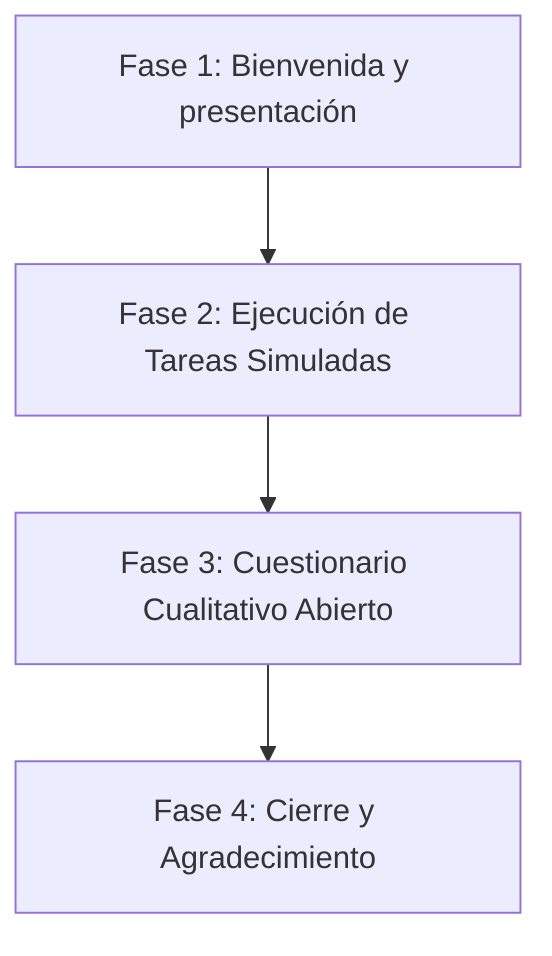

# Guía de Entrevistas de Validación - Centralis

Esta guía metodológica detalla el proceso para planificar, grabar y ejecutar las entrevistas de validación cualitativa asociadas al **Capítulo VIII (Experiment-Driven Development)** de **Centralis**. El propósito es garantizar la consistencia científica en la recolección de retroalimentación cualitativa durante las sesiones de prueba con los usuarios finales.

---

## 1. Definición y Tamaño de la Muestra (¿A cuántas personas entrevistar?)

Para asegurar que las pruebas de usabilidad y de hipótesis posean validez cualitativa. Dado que los 4 experimentos involucran distintos perfiles y diseños de prueba (dentro de sujetos), se consolidará la muestra en **6 participantes únicos** divididos en dos perfiles:

### Resumen de Muestra Necesaria
*   **Total de Participantes Únicos:** 6 personas.
    *   **3 Gerentes / Administradores de PyMEs:** Encargados de gestionar equipos y logística interna (Segmento A).
    *   **3 Empleados / Colaboradores:** Receptores de notificaciones y asistentes diarios (Segmento B).

### Distribución de Participantes por Experimento
| ID Experimento | Característica Evaluada | Diseño de Prueba | Muestra Requerida | Cobertura en la Muestra Consolidada |
| :---: | :--- | :--- | :--- | :--- |
| **EX-01** | Analíticas progresivas SSE | Dentro de Sujetos | **3 Gerentes** (Prueban versión A y B) | Cubierto por los 3 gerentes reclutados (Segmento A). |
| **EX-02** | Confirmación binaria de eventos | Dentro de Sujetos | **3 Empleados** (Prueban versión A y B) | Cubierto por los 3 empleados reclutados (Segmento B). |
| **EX-03** | Sincronización reactiva de estados | Dentro de Sujetos | **3 Gerentes** (Prueban versión A y B) | Cubierto por los 3 gerentes reclutados (Segmento A). |
| **EX-04** | Reserva de espacios físicos | Comparativo | **3 Gerentes y 3 Empleados** | Cubierto por la totalidad de la muestra consolidada (6 participantes). |

---

## 2. El Proceso de Grabación Paso a Paso

El facilitador y el equipo técnico deben estructurar la sesión en 5 fases diferenciadas:

### Fase 1: Bienvenida y presentación 
* Recibir al participante y explicar la dinámica.

### Fase 2: Ejecución de Tareas Simuladas
El facilitador presentará escenarios específicos sin dar instrucciones paso a paso sobre cómo presionar los botones, para evaluar la usabilidad natural.

*   **Tarea para Gerentes (EX-01, EX-03, EX-04):**
    1.  *"Por favor, ingresa al panel de un anuncio de la empresa y revisa quiénes lo han leído."* (Validar EX-01).
    2.  *"Ahora, crea un evento corporativo de capacitación y asigna a 3 empleados de tu área."* (Validar EX-03).
    3.  *"Durante la creación del mismo evento, reserva el Laboratorio de Innovación para evitar que otro gerente lo ocupe a la misma hora."* (Validar EX-04).
*   **Tarea para Empleados (EX-02, EX-04):**
    1.  *"Revisa tu feed de eventos. Tienes una invitación pendiente para una capacitación semanal."* (Validar EX-02).
    2.  *"Responde a la invitación aceptando su asistencia."* (Validar EX-02).
    3.  *"Confirma dónde se llevará a cabo el evento asignado."* (Validar EX-04).

### Fase 3: Cuestionario Cualitativo 
Detener las tareas y realizar las preguntas del diseño de entrevistas (Sección 8.3.4.1 de `Capítulo_VIII.md`), profundizando en la percepción de velocidad, fluidez y utilidad de las alertas.

**Cuestionario del Segmento A: Gerentes y Administradores**

| Experimento | Variable / Hipótesis a Validar          | Pregunta de Validación Cualitativa                           |
| :---------: | :-------------------------------------- | :----------------------------------------------------------- |
|  **EX-01**  | Fluidez y retención en analíticas (H₁)  | ¿Cómo calificaría la velocidad de carga del panel de analíticas al abrirlo? ¿Llegó a percibir algún retraso o bloqueo de la aplicación móvil? |
|  **EX-03**  | Sincronización reactiva en Flutter (H₁) | Durante el flujo de asignación de miembros al evento, ¿notó si la lista de empleados disponibles se actualizaba automáticamente, o tuvo el impulso de retroceder o refrescar manualmente la vista? |
|  **EX-04**  | Reserva de espacios físicos (H₁)        | ¿Qué tan intuitivo y útil le resultó el selector de espacios (salas, laboratorios, oficinas) al programar el evento grupal en la app móvil? |

**Cuestionario del Segmento B: Empleados y Colaboradores**

| Experimento | Variable / Hipótesis a Validar   | Pregunta de Validación Cualitativa                           |
| :---------: | :------------------------------- | :----------------------------------------------------------- |
|  **EX-02**  | Predictibilidad y adopción       | Frente a la alternativa de responder de forma manual por WhatsApp o chat, ¿qué valor le atribuye a poder confirmar o rechazar su asistencia con un solo clic dentro de la app oficial? |
|  **EX-04**  | Ubicación física oficial (H₁)    | ¿Le resultó fácil identificar la ubicación física exacta del evento en la tarjeta del feed? ¿De qué manera influye esto en su preparación previa? |
|  **EX-04**  | Centralización de la información | ¿Cómo describiría la experiencia de tener la ubicación, la reserva de la sala y los detalles del evento consolidados en una sola tarjeta, en comparación con los flujos de comunicación informal previos? |

### Fase 4: Cierre y Detención de Grabación 
*   Agradecer al participante.
*   Detener la grabación y guardar el archivo de video con la nomenclatura: `ENTREVISTA_[ROL]_[PARTICIPANTE_ID].mp4`.

---

## 3. Estructura y Diseño de la Hoja de Registro Google Sheets

Para dar cumplimiento al **Web and Mobile Tracking Plan (Sección 8.2.8)**, el evaluador debe registrar de manera manual y cuantitativa el comportamiento de los participantes en una hoja de cálculo. Se proponen dos hojas principales dentro del libro de Excel para la recolección y consolidación de las métricas.

https://docs.google.com/spreadsheets/d/1YVRMiwo2f9rdRHKk0OKBBJxS8FWZ1ehgqrygkOSidlg/edit?usp=sharing

### Hoja 1: Registro Individual de Sesiones
En esta hoja se registra cada interacción durante la prueba de usabilidad. Cada fila representa una sesión de prueba para un participante.

| Columna | Tipo de Dato | Opciones / Formato | Propósito de Medición |
| :--- | :--- | :--- | :--- |
| **ID_Participante** | Identificador | P01, P02, ..., P06 | Identificar de forma anónima al usuario. |
| **Rol** | Categórico | Gerente / Empleado | Clasificar el segmento objetivo. |
| **EX01_Abandono** | Booleano | Sí / No | Registrar si el gerente abandonó la pantalla de analíticas antes de la carga (Mide *DBM-01*). |
| **EX01_Exito_Tarea** | Booleano | Sí / No | Registrar si se completó la auditoría con éxito (Mide *DBM-02*). |
| **EX02_Interaccion** | Categórico | Aceptar / Rechazar / Ninguno | Registrar si el empleado usó el botón binario de confirmación (Mide *DBM-04*). |
| **EX03_Refrescos_Manuales** | Entero | Conteo numérico ($\ge 0$) | Contar gestos de *pull-to-refresh* o clics innecesarios para actualizar listas (Mide *DBM-08*). |
| **EX04_Conflictos_Reserva**| Entero | Conteo numérico ($\ge 0$) | Contar las colisiones de espacio físico generadas al programar eventos (Mide *DBM-06*). |

### Hoja 2: Consolidador de Métricas de Negocio (Dashboard)
Esta hoja calcula automáticamente los indicadores clave y evalúa si se alcanzaron los criterios de éxito especificados en las Tarjetas de Experimento (`EX-01` a `EX-04`).

| ID Métrica | Métrica de Dominio (DBM) | Fórmula en Excel | Criterio de Éxito / Umbral |
| :---: | :--- | :--- | :--- |
| **DBM-01** | Screen Abandonment Rate | `=CONTAR.SI.CONJUNTO(EX01_Abandono, "Sí", Rol, "Gerente") / CONTAR.SI(Rol, "Gerente")` | $0\%$ de abandonos (ninguno de los 3 gerentes abandona). |
| **DBM-02** | Task Success Rate (Auditoría) | `=CONTAR.SI.CONJUNTO(EX01_Exito_Tarea, "Sí", Rol, "Gerente") / CONTAR.SI(Rol, "Gerente")` | $\ge 66.7\%$ (Al menos 2 de 3 gerentes completan la tarea). |
| **DBM-04** | Active Interaction Rate | `=CONTAR.SI.CONJUNTO(EX02_Interaccion, "<>Ninguno", Rol, "Empleado") / CONTAR.SI(Rol, "Empleado")` | $\ge 66.7\%$ (Al menos 2 de 3 empleados interactúan con los botones). |
| **DBM-08** | Unnecessary Actions Count | `=PROMEDIO.SI(Rol, "Gerente", EX03_Refrescos_Manuales)` | Promedio de refrescos manuales $= 0$ para los gerentes. |
| **DBM-06** | Occupancy Conflict Rate | `=CONTAR.SI.CONJUNTO(EX04_Conflictos_Reserva, ">0", Rol, "Gerente") / CONTAR.SI(Rol, "Gerente")` | $0\%$ de colisiones de reserva física. |

### Datos de Ejemplo (Test Data) para Validación de Fórmulas

Para facilitar la verificación y el testeo de las fórmulas del Dashboard en Excel/Google Sheets, a continuación se presenta una tabla con **datos de prueba simulados** para rellenar en la **Hoja 1**. Estos datos simulan un escenario realista donde se cumplen de forma ajustada todos los criterios de éxito del proyecto:

| ID_Participante | Rol | EX01_Abandono | EX01_Exito_Tarea | EX02_Interaccion | EX03_Refrescos_Manuales | EX04_Conflictos_Reserva |
| :---: | :---: | :---: | :---: | :---: | :---: | :---: |
| **P01** | Gerente | No | Sí | Ninguno | 0 | 0 |
| **P02** | Gerente | No | Sí | Ninguno | 0 | 0 |
| **P03** | Gerente | No | No | Ninguno | 0 | 0 |
| **P04** | Empleado | No Aplica | No Aplica | Aceptar | No Aplica | No Aplica |
| **P05** | Empleado | No Aplica | No Aplica | Rechazar | No Aplica | No Aplica |
| **P06** | Empleado | No Aplica | No Aplica | Ninguno | No Aplica | No Aplica |

#### Resultados Calculados en la Hoja 2 con estos Datos:
* **DBM-01 (Screen Abandonment Rate):** `=0 / 3 = 0%` (Criterio de éxito: **CUMPLE**).
* **DBM-02 (Task Success Rate - Auditoría):** `=2 / 3 = 66.7%` (Criterio de éxito: **CUMPLE**).
* **DBM-04 (Active Interaction Rate):** `=2 / 3 = 66.7%` (Criterio de éxito: **CUMPLE**).
* **DBM-08 (Unnecessary Actions Count):** `=(0 + 0 + 0) / 3 = 0` (Criterio de éxito: **CUMPLE**).
* **DBM-06 (Occupancy Conflict Rate):** `=0 / 3 = 0%` (Criterio de éxito: **CUMPLE**).

